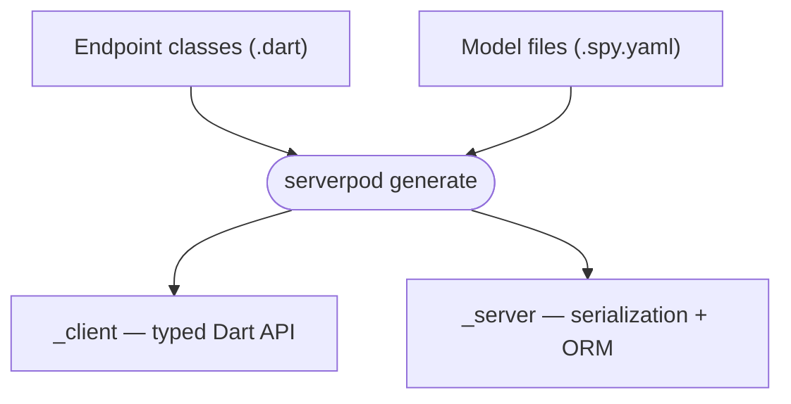
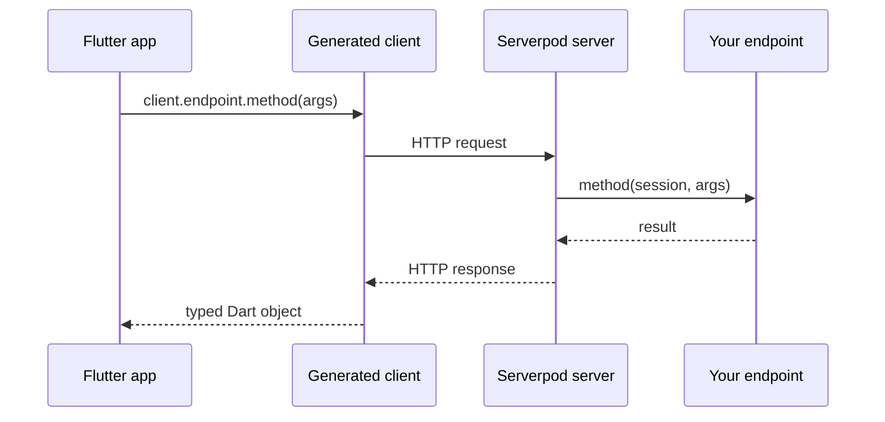

# How Serverpod works

This page explains the mental model behind Serverpod — the project structure, how code generation works, and what happens when your Flutter app calls the server. It is a complement to the [get-started tutorial](./01-get-started/01-creating-endpoints.md), which teaches by doing. This page explains the why and how underneath.

## Project structure

When you run `serverpod create`, it produces three Dart packages in a single workspace:

```text
my_project/
├── my_project_server/   # Your server-side code — endpoints, business logic, models.
├── my_project_client/   # Auto-generated. Never edit by hand.
└── my_project_flutter/  # Your Flutter app.
```

The split is intentional. The `_server` package runs on your infrastructure and can safely hold secrets, database access, and privileged logic. The `_flutter` package runs on the user's device and must never contain those things. The `_client` package is the bridge — it is generated automatically from your server code and gives the Flutter app a typed Dart API to call the server with, without exposing any server internals.

Because `_client` is always generated and never edited manually, it stays in sync with the server by construction. You do not write serialization code, HTTP calls, or API contracts by hand.

## Code generation

Serverpod's code generator reads two kinds of source files from the `_server` package:

- **Endpoint classes** — Dart files that extend `Endpoint`. Each public method on an endpoint class becomes a callable method in the generated client.
- **Model files** — YAML files with a `.spy.yaml` extension that define your data classes, enums, and exceptions.

Running `serverpod generate` produces output in two places:



The `_client` package gets a typed Dart class for every endpoint and a matching Dart class for every model. The `_server` package gets serialization logic and, for models that declare a database table, the ORM interface.

You run `serverpod generate` whenever you add or change an endpoint method or a model file to update the `_client` package with the new changes.

## Request lifecycle

When your Flutter app calls a server method, several steps happen transparently:



From the Flutter app's perspective, calling the server looks identical to calling a local Dart method. The generated client handles serialization, the HTTP transport, and deserialization of the response. Your endpoint method receives the arguments as ordinary Dart values and returns an ordinary Dart value.

### Real-time streaming

Regular endpoint methods follow the request/response lifecycle above. For real-time use cases — live updates, collaborative features, multiplayer — Serverpod also supports [streaming endpoints](./06-concepts/15-streams.md), which keep a WebSocket connection open and let server and client push data to each other continuously.

### Session

The `Session` parameter that every endpoint method receives is Serverpod's request context. It gives the method access to the database, cache, authenticated user information, and logging — scoped to the lifetime of that single request. It is not a singleton; each call gets its own `Session` instance.

## Type safety across the stack

Serverpod's model files (`.spy.yaml`) are the single source of truth for your data shapes. When you run `serverpod generate`, the same Dart class is generated in both `_server` and `_client`. This means the object your endpoint returns and the object your Flutter app receives are the same type — not two hand-maintained copies that can drift apart.

This eliminates an entire category of bugs common in traditional client-server development: mismatched field names, wrong types, forgotten null checks after an API change. When you rename a field in a model file and regenerate, the compiler immediately surfaces every place in both the server and the app that needs updating.
