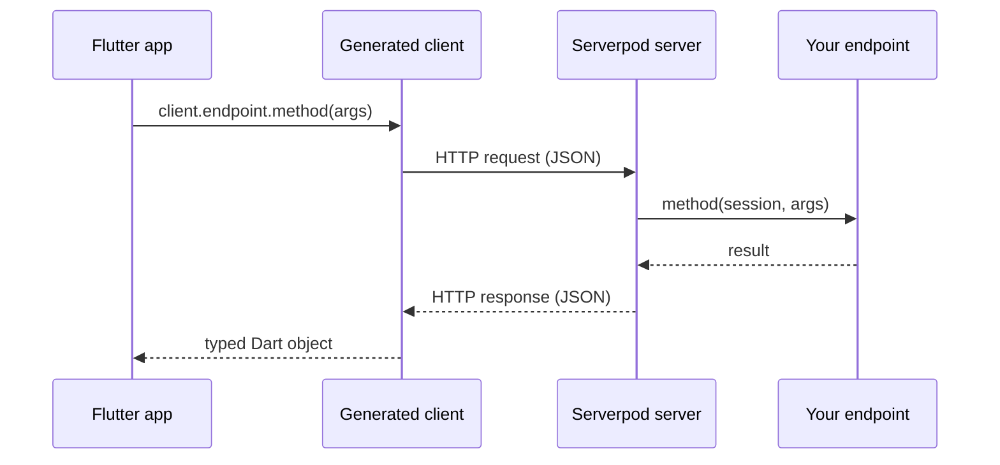

# How Serverpod works

This page explains Serverpod's architecture: how the project structure, code generation, and request lifecycle work together to provide full-stack type safety.

## Project structure

When you run `serverpod create`, it produces three Dart packages in a single workspace:

```text
my_project/
├── my_project_server/   # Your server-side code
├── my_project_client/   # Auto-generated. Never edit by hand.
└── my_project_flutter/  # Your Flutter app.
```

The `_server` package holds your backend code, while the `_client` package acts as a bridge, providing the Flutter app with a typed API to call the server.

Because the `_client` package is auto-generated from the `_server` code, it stays in sync by construction. You do not write serialization code, HTTP calls, or API contracts by hand.

## Code generation

The purpose of code generation is to eliminate boilerplate and provide type-safety. Serverpod continuously watches for changes in your `_server` package and the generator automatically creates the necessary code.

The generator reads two kinds of source files:
- **Model files (`.spy.yaml`)** defining your data classes.
- **Endpoint classes** defining your server's API.

From these files, Serverpod generates:
- **A typed client** in the `_client` package, allowing your Flutter app to call the backend with full type-safety.
- **Serialization and ORM classes** in the `_server` package, for database access and communication.

## Calling the backend

Thanks to the generated client, calling a server endpoint from your Flutter app feels like a local method call. You do not need to write any networking or serialization code.

```dart
var result = await client.greeting.hello('World');
```

This example calls the `hello` method on the `greeting` endpoint. The generated client handles the JSON serialization, HTTP request, and response deserialization automatically.

## Request lifecycle

When your Flutter app calls a server method, the generated client serializes the request and sends it to the server. Serverpod uses a protocol similar to JSON-RPC, which makes remote method calls feel like local function calls instead of traditional REST requests.

The diagram below shows the journey of a request:



### Real-time streaming

Regular endpoint methods follow the request/response lifecycle above. For real-time use cases like live updates, collaborative features, and multiplayer, Serverpod also supports [streaming endpoints](./06-concepts/15-streams.md), which keep a WebSocket connection open and let server and client push data to each other continuously.

### Session

The `Session` parameter that every endpoint method receives is Serverpod's request context. It gives the method access to the database, cache, authenticated user information, and logging, all of which are scoped to the lifetime of that single request. It is not a singleton; each call gets its own `Session` instance.

## Type safety across the stack

Type safety across the entire stack, from the database to your Flutter app, is guaranteed because Serverpod's model files (`.spy.yaml`) are the single source of truth. When code is generated, the same Dart class is used for database queries, server-side logic, and the client-side app.

This eliminates a whole category of bugs common in traditional client-server development, such as mismatched field names, incorrect types, or forgotten null checks after an API change. If you rename a field in a model file and regenerate, the Dart compiler immediately tells you every place in both the server and the app that needs updating.
