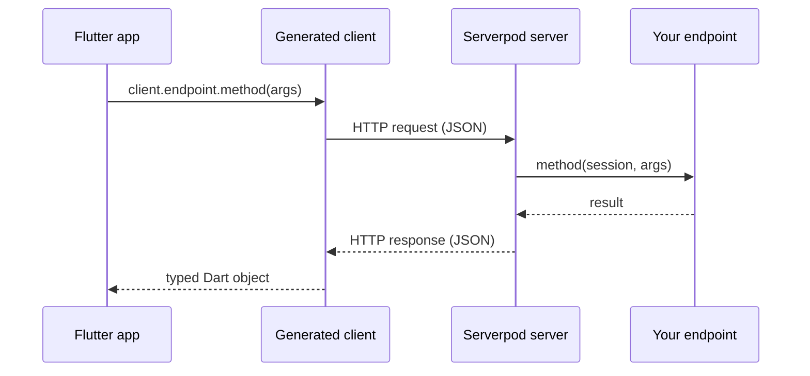

# How Serverpod works

Serverpod is built around three Dart packages and a code generator, which bridges the gap between your server-side logic, your database, and your Flutter app. Together, they give you full-stack type safety from your database to your Flutter app.

## Project structure

When you run `serverpod create`, it produces three Dart packages in a single workspace:

```text
my_project/
├── my_project_server/   # Your server-side code
├── my_project_client/   # Auto-generated. Never edit by hand.
└── my_project_flutter/  # Your Flutter app.
```

The `_server` package holds your backend code, while the `_client` package acts as a bridge, providing the Flutter app with a typed API to call the server.

Because the client package is auto-generated from the server code, there is no need to write serialization code, HTTP calls, or API contracts.

## Code generation

Code generation cuts boilerplate and keeps types in sync between server and app. Serverpod watches your `_server` package as you edit and runs the generator automatically.

The generator reads two kinds of source files:
- **Model files (`.spy.yaml`)** defining your data classes.
- **Endpoint classes** defining your server's API.

From these files, Serverpod generates:
- **A typed client** in the `_client` package, allowing your Flutter app to call the backend with full type-safety.
- **Serialization and ORM classes** in the `_server` package, for database access and communication.

## Calling the backend

Thanks to the generated client, calling a server endpoint from your Flutter app feels like a local method call. You do not need to write any networking or serialization code.

```dart
final result = await client.greeting.hello('World');
```

This example calls the `hello` method on the `greeting` endpoint. The generated client handles the JSON serialization, HTTP request, and response deserialization automatically.

## Request lifecycle

When your Flutter app calls a server method, the generated client serializes the request and sends it to the server. Serverpod uses a protocol similar to JSON-RPC, which makes remote method calls feel like local function calls instead of traditional REST requests.

The diagram below shows the journey of a request:



### Real-time streaming

Regular endpoint methods follow the request/response lifecycle above. For real-time use cases like live updates, collaborative features, and multiplayer, Serverpod also supports [streaming endpoints](./06-concepts/15-streams.md), which keep a WebSocket connection open and let server and client push data to each other continuously.

### Session

The `Session` parameter that every endpoint method receives is the context for that single request. It gives access to the database, cache, signed-in user, and logging, all available only while the request runs. Each call gets its own `Session`.

## Type safety across the stack

Type safety across the entire stack, from the database to your Flutter app, is guaranteed because Serverpod's model files (`.spy.yaml`) are the single source of truth. When code is generated, the same Dart class is used in database queries, server logic, and your Flutter app.

This eliminates a whole category of bugs common in traditional client-server development, such as mismatched field names, incorrect types, or forgotten null checks after an API change. If you rename a field in a model file and regenerate, the Dart compiler immediately tells you every place in both the server and the app that needs updating.
