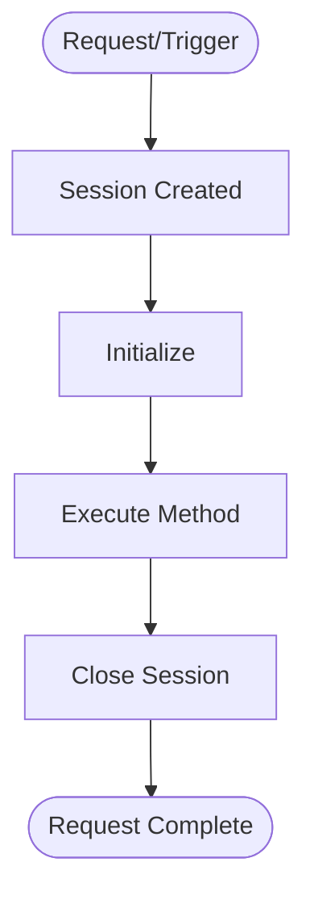

# Sessions

A Session in Serverpod is a request-scoped context object that exists for the duration of a single client request or connection. It provides access to server resources and maintains state during request processing.

Sessions are the gateway to Serverpod's functionality - every interaction with the database, cache, file storage, or messaging system happens through a session. The framework automatically creates the appropriate session type when a client makes a request, manages its lifecycle, and ensures proper cleanup when the request completes. For special cases like background tasks or system operations, you can also create and manage sessions manually.

:::note

A Serverpod Session should not be confused with the concept of "web sessions" or "user sessions" which persist over multiple API calls. See the [Authentication documentation](./11-authentication/01-setup.md) for managing persistent authentication.

:::

## Quick reference

### Essential properties

- **`db`** - Database access. [See database docs](./06-database/01-connection.md)
- **`caches`** - Local and distributed caching. [See caching docs](./08-caching.md)
- **`storage`** - File storage operations. [See file uploads](./12-file-uploads.md)
- **`messages`** - Server events for real-time communication within and across servers. [See server events docs](./16-server-events.md)
- **`passwords`** - Credentials from config and environment. [See configuration](./07-configuration.md)
- **`authenticated`** - Current user authentication info. [See authentication docs](./11-authentication/02-basics.md)

### Key methods

- **`log(message, level)`** - Add log entry
- **`addWillCloseListener(callback)`** - Register cleanup callback

## Session types

Serverpod creates different session types based on the context:

| Type                    | Created For                  | Lifetime            | Common Use Cases             |
| ----------------------- | ---------------------------- | ------------------- | ---------------------------- |
| **MethodCallSession**   | `Future<T>` endpoint methods | Single request      | API calls, CRUD operations   |
| **WebCallSession**      | Web server routes            | Single request      | Web pages, form submissions  |
| **MethodStreamSession** | `Stream<T>` endpoint methods | Stream duration     | Real-time updates, chat      |
| **StreamingSession**    | WebSocket connections        | Connection duration | Live dashboards, multiplayer |
| **FutureCallSession**   | Scheduled tasks              | Task execution      | Email sending, batch jobs    |
| **InternalSession**     | Manual creation              | Until closed        | Background work, migrations  |

### Example: Automatic session (MethodCallSession)

```dart
// lib/src/endpoints/example_endpoint.dart
class ExampleEndpoint extends Endpoint {
  Future<String> hello(Session session, String name) async {
    // MethodCallSession is created automatically
    return 'Hello $name';
    // Session closes automatically when method returns
  }
}
```

### Example: Manual session (InternalSession)

InternalSession is the only session type that requires manual management:

```dart
Future<void> performMaintenance() async {
  var session = await Serverpod.instance.createSession();
  try {
    // Perform operations
    await cleanupOldRecords(session);
    await updateStatistics(session);
  } finally {
    await session.close(); // Must close manually!
  }
}
```

**Important**: Always use try-finally with InternalSession to prevent memory leaks.

## Session lifecycle



Sessions follow a predictable lifecycle from creation to cleanup. When a client makes a request, Serverpod automatically creates the appropriate session type (see table above), initializes it with a unique ID, and sets up access to resources like the database, cache, and file storage.

During the active phase, your operation executes with full access to Serverpod resources through the session. You can query the database, write logs, send messages, and access storage - all operations are tracked and tied to this specific session. When the operation completes, most sessions close automatically, writing any accumulated logs to the database and releasing all resources.

### Internal Sessions

The only exception is `InternalSession`, which you create manually for background tasks. Manual sessions require explicit closure with `session.close()`. Forgetting to close these sessions causes memory leaks as logs accumulate indefinitely. Always use try-finally blocks to ensure proper cleanup. After any session closes, attempting to use it throws a `StateError`.

### Session cleanup callbacks

You can register callbacks that execute just before a session closes using `addWillCloseListener`. This is useful for cleanup operations, releasing resources, or performing final operations:

```dart
Future<void> processData(Session session) async {
  var tempFile = File('/tmp/processing_data.tmp');

  // Register cleanup callback
  session.addWillCloseListener((session) async {
    if (await tempFile.exists()) {
      await tempFile.delete();
      session.log('Cleaned up temporary file');
    }
  });

  // Process data using temp file
  await tempFile.writeAsString('processing...');
  // Session closes automatically, cleanup callback runs
}
```

Cleanup callbacks run in the order they were registered and are called for all session types, including manual sessions when you call `session.close()`.

## Logging

Serverpod batches log entries for performance. During normal operations, logs accumulate in memory and are written to the database in a single batch when the session closes. This includes all your `session.log()` calls, database query timings, and session metadata. The exception is streaming sessions (`MethodStreamSession` and `StreamingSession`), which write logs continuously by default to avoid memory buildup during long connections.

:::warning

If you forget to close a manual session (`InternalSession`), logs remain in memory indefinitely and are never persisted - this is a common cause of both memory leaks and missing debug information.

:::

## Common pitfalls and solutions

### Pitfall 1: Using session after method returns

**Problem:** Using a session after it's closed throws a `StateError`

```dart
Future<void> processUser(Session session, int userId) async {
  var user = await User.db.findById(session, userId);

  // Schedule async work
  Timer(Duration(seconds: 5), () async {
    // ❌ Session is already closed!
    // This will throw: StateError: Session is closed
    await user.updateLastSeen(session);
  });

  return; // Session closes here
}
```

**Solution 1 - Use FutureCalls:**

```dart
Future<void> processUser(Session session, int userId) async {
  var user = await User.db.findById(session, userId);

  // Schedule through Serverpod
  await session.serverpod.futureCallWithDelay(
    'updateLastSeen',
    UserIdData(userId: userId),
    Duration(seconds: 5),
  );

  return;
}
```

**Solution 2 - Create manual session:**

```dart
Future<void> processUser(Session session, int userId) async {
  var user = await User.db.findById(session, userId);

  Timer(Duration(seconds: 5), () async {
    // Create new session for async work
    var newSession = await Serverpod.instance.createSession();
    try {
      await user.updateLastSeen(newSession);
    } finally {
      await newSession.close();
    }
  });

  return;
}
```

### Pitfall 2: Forgetting to close manual sessions

**Problem:**

```dart
// ❌ Memory leak!
var session = await Serverpod.instance.createSession();
var users = await User.db.find(session);
// Forgot to close - session leaks memory
```

**Solution - Always use try-finally:**

```dart
var session = await Serverpod.instance.createSession();
try {
  var users = await User.db.find(session);
  // Process users
} finally {
  await session.close(); // Always runs
}
```

## Best practices

### 1. Let Serverpod manage sessions when possible

Prefer using the session provided to your endpoint rather than creating new ones:

```dart
// ✅ Good - Use provided session
Future<List<User>> getActiveUsers(Session session) async {
  return await User.db.find(
    session,
    where: (t) => t.isActive.equals(true),
  );
}

// ❌ Avoid - Creating unnecessary session
Future<List<User>> getActiveUsers(Session session) async {
  var newSession = await Serverpod.instance.createSession();
  try {
    return await User.db.find(newSession, ...);
  } finally {
    await newSession.close();
  }
}
```

### 2. Use FutureCalls for delayed operations

Instead of managing sessions for async work, use Serverpod's future call system:

```dart
// ✅ Good - Let Serverpod manage the session
await serverpod.futureCallWithDelay(
  'processPayment',
  PaymentData(orderId: order.id),
  Duration(hours: 1),
);

// ❌ Complex - Manual session management
Future.delayed(Duration(hours: 1), () async {
  var session = await Serverpod.instance.createSession();
  try {
    await processPayment(session, order.id);
  } finally {
    await session.close();
  }
});
```

### 3. Handle errors properly

Always handle exceptions to prevent unclosed sessions:

```dart
// ✅ Good - Errors won't prevent session cleanup
Future<void> safeOperation() async {
  var session = await Serverpod.instance.createSession();
  try {
    await riskyOperation(session);
  } catch (e) {
    session.log('Operation failed: $e', level: LogLevel.error);
    // Handle error appropriately
  } finally {
    await session.close();
  }
}
```

## Testing

When testing endpoints, the `TestSessionBuilder` can be used to simulate and configure session properties for controlled test scenarios:

```dart
withServerpod('test group', (sessionBuilder, endpoints) {
  test('endpoint test', () async {
    var result = await endpoints.users.getUser(sessionBuilder, 123);
    expect(result.name, 'John');
  });

  test('authenticated endpoint test', () async {
    const int userId = 1234;

    var authenticatedSessionBuilder = sessionBuilder.copyWith(
      authentication: AuthenticationOverride.authenticationInfo(userId, {Scope('user')}),
    );

    var result = await endpoints.users.updateProfile(
      authenticatedSessionBuilder,
      ProfileData(name: 'Jane')
    );
    expect(result.success, isTrue);
  });
});
```

For detailed testing strategies, see the [testing documentation](./19-testing/01-get-started.md).
