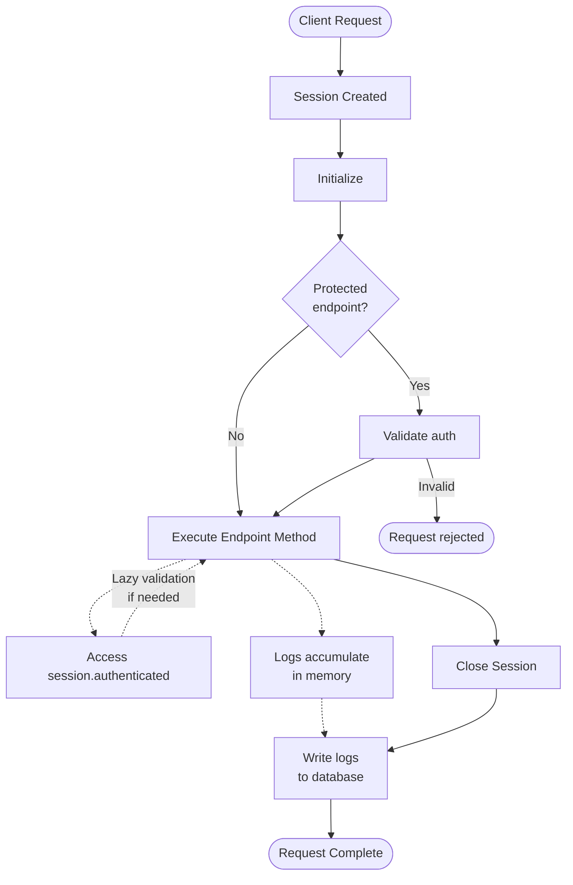

# Sessions

A Session in Serverpod is a request-scoped context object that exists for the duration of a single client request or connection. It provides access to server resources and maintains state during request processing.

:::note

A Serverpod Session should not be confused with the concept of "web sessions" or "user sessions" which persist over multiple API calls. See the [Authentication documentation](./11-authentication/01-setup.md) for managing persistent authentication.

:::

## Session lifecycle

Understanding the session lifecycle is crucial for proper resource management and avoiding common pitfalls in Serverpod applications.



### Client Request

When a client makes a request to your Serverpod server, the framework automatically determines what type of session to create based on the request type:

1. **HTTP request** → `MethodCallSession` for endpoint method calls
2. **WebSocket stream** → `MethodStreamSession` for streaming endpoints
3. **WebSocket connection** → `StreamingSession` for real-time connections
4. **Scheduled task** → `FutureCallSession` for future calls
5. **Internal operations** → `InternalSession` created by framework or manually via `Serverpod.instance.createSession()`

### Session Created & Initialize

Once Serverpod determines the session type, it creates and initializes the session:

- Generates a unique session ID (`UuidValue`)
- Records the start time
- Sets up the logging system (if enabled in configuration)
- Initializes resource accessors (database, cache, storage, messaging)
- Stores the authentication key (if provided in the request)

Sessions are normally created automatically by the framework. The exception is `InternalSession`, which you create manually for background tasks (see [InternalSession - System operations](#internalsession---system-operations)).

### Execute Endpoint Method

During method execution, the session provides access to all server resources:

1. **Authentication** - Validated automatically before execution if endpoint has `requireLogin: true` or `requiredScopes`, otherwise lazy-loaded on first access to `session.authenticated`
2. **Logging** - Log entries accumulate in memory during execution
3. **Database operations** - Queries are counted, timed, and logged
4. **Request context** - Endpoint name, method, and metadata remain accessible

```dart
// Example: Endpoint without requireLogin (uses lazy authentication)
Future<User?> getUser(Session session, int userId) async {
  // Authentication is checked here on first access (lazy loading)
  var authInfo = await session.authenticated;
  if (authInfo == null) {
    throw UnauthorizedException();
  }

  // Logs accumulate in memory
  session.log('Fetching user $userId');

  // Database operations are tracked
  return await User.db.findById(session, userId);
}
```

### Close Session

Sessions close either automatically or manually:

**Automatic closure:**

- Method calls: After the endpoint method returns
- Streaming: When the WebSocket connection ends
- Future calls: After the scheduled task completes

**Manual closure:**

- Internal sessions: Must call `session.close()` explicitly

When closing, the session:

1. Becomes unusable (further operations throw `StateError`)
2. Executes any cleanup callbacks registered with `addWillCloseListener()`
3. Removes all message channel subscriptions

#### Cleanup callbacks

For custom resources that need cleanup when a session closes:

```dart
Future<void> processWithExternalService(Session session) async {
  var service = await ExternalService.connect();

  // Ensure cleanup even if session closes unexpectedly
  session.addWillCloseListener((session) async {
    await service.disconnect();
  });

  // Use service...
}
```

### Write logs to database

After the session closes, all accumulated logs are written to the database in a single batch:

- All log entries stored in memory during execution are persisted
- Database query timings and counts are recorded
- Session metadata (duration, endpoint, method) is saved
- Returns a session log ID for debugging and tracing

**Exception:** Streaming sessions write logs immediately instead of batching.

### Request Complete

Once logs are written, the request lifecycle is complete and all resources are released.

### Invalid session usage

Using a session after it's closed throws a `StateError`:

```dart
Future<void> badExample(Session session) async {
  var data = await fetchData(session);

  // DON'T DO THIS - Session closes when method returns
  Timer(Duration(seconds: 1), () {
    // This will throw: StateError: Session is closed, and logging
    // can no longer be performed.
    session.log('Delayed log'); // ❌ Session already closed!
  });

  return data;
}
```

## Authentication flow

Authentication in sessions works differently based on endpoint configuration:

### For endpoints with `requireLogin: true` or `requiredScopes`

1. **Authentication key passed** - Client sends auth key in header
2. **Validation on request** - Authentication is validated immediately before the endpoint method executes
3. **Result cached** - Authentication info is cached for the session lifetime

### For other endpoints (lazy loading)

1. **Authentication key passed** - Client sends auth key in header
2. **Key stored in session** - Session stores the key but doesn't validate yet
3. **First access triggers validation** - Calling `session.authenticated` runs the authentication handler
4. **Result cached** - Authentication info is cached for the session lifetime

This approach means:

- Protected endpoints fail fast if authentication is invalid
- Unprotected endpoints don't pay the authentication cost unless needed
- Multiple calls to `session.authenticated` don't re-validate

## Logging mechanics

The session logging system is designed to batch operations for performance (default behavior):

### Write timing

**Method calls**: Logs are written once when the session closes (default)

```dart
// Logs written after method completes
Future<String> myMethod(Session session) async {
  session.log('Step 1');
  session.log('Step 2');
  return 'done';
  // <- Logs written to database here
}
```

**Streaming sessions**: Write logs continuously by default

```dart
Stream<int> count(Session session) async* {
  for (var i = 0; i < 10; i++) {
    session.log('Count: $i'); // Written immediately
    yield i;
  }
}
```

### Lost logs

If a session isn't properly closed:

- Logs remain in memory and are never written
- Memory usage grows until the process restarts
- Debugging information is permanently lost

## Common pitfalls and solutions

### Pitfall 1: Using session after method returns

**Problem:**

```dart
Future<void> processUser(Session session, int userId) async {
  var user = await User.db.findById(session, userId);

  // Schedule async work
  Timer(Duration(seconds: 5), () async {
    // ❌ Session is already closed!
    await user.updateLastSeen(session);
  });

  return; // Session closes here
}
```

**Solution 1 - Use FutureCalls:**

```dart
Future<void> processUser(Session session, int userId) async {
  var user = await User.db.findById(session, userId);

  // Schedule through Serverpod
  await session.serverpod.futureCallWithDelay(
    'updateLastSeen',
    UserIdData(userId: userId),
    Duration(seconds: 5),
  );

  return;
}
```

**Solution 2 - Create manual session:**

```dart
Future<void> processUser(Session session, int userId) async {
  var user = await User.db.findById(session, userId);

  Timer(Duration(seconds: 5), () async {
    // Create new session for async work
    var newSession = await Serverpod.instance.createSession();
    try {
      await user.updateLastSeen(newSession);
    } finally {
      await newSession.close();
    }
  });

  return;
}
```

### Pitfall 2: Forgetting to close manual sessions

**Problem:**

```dart
// ❌ Memory leak!
var session = await Serverpod.instance.createSession();
var users = await User.db.find(session);
// Forgot to close - session leaks memory
```

**Solution - Always use try-finally:**

```dart
var session = await Serverpod.instance.createSession();
try {
  var users = await User.db.find(session);
  // Process users
} finally {
  await session.close(); // Always runs
}
```

## Working with different session types

Understanding when each session type appears in your code:

### MethodCallSession - Standard API calls

Created for: `Future<T>` endpoint methods
Lifetime: Single request-response cycle
Common in: User authentication, data fetching, CRUD operations

```dart
Future<String> hello(Session session, String name) async {
  // You're working with a MethodCallSession here
  // It will close automatically after this method returns
  return 'Hello $name';
}
```

### MethodStreamSession - Real-time communication

Created for: `Stream<T>` endpoint methods or stream parameters
Lifetime: Duration of the stream
Common in: Chat applications, live notifications, real-time collaboration

```dart
Stream<Message> chat(Session session, Stream<String> incoming) async* {
  // MethodStreamSession stays open for the stream duration
  await for (var message in incoming) {
    yield Message(text: message, time: DateTime.now());
  }
  // Closes when stream completes
}
```

### FutureCallSession - Background tasks

Created for: Scheduled operations
Lifetime: Task execution duration
Common in: Email sending, report generation, data cleanup

```dart
class EmailSender extends FutureCall {
  @override
  Future<void> invoke(Session session, EmailData? data) async {
    // FutureCallSession created just for this task
    await sendEmail(session, data!);
    // Closes when task completes
  }
}
```

### InternalSession - System operations

Created for: Internal framework operations and manual background work
Lifetime: Until explicitly closed (manual sessions only)
Common in: Database migrations, batch imports, maintenance tasks, framework internals

```dart
// Cleanup old data periodically
Future<void> cleanupOldData() async {
  var session = await Serverpod.instance.createSession(
    enableLogging: false, // Often disabled for system tasks
  );
  try {
    await OldData.db.deleteWhere(
      session,
      where: (t) => t.createdAt < DateTime.now().subtract(Duration(days: 90)),
    );
  } finally {
    await session.close(); // Must close manually
  }
}
```

## Best practices

### 1. Let Serverpod manage sessions when possible

Prefer using the session provided to your endpoint rather than creating new ones:

```dart
// ✅ Good - Use provided session
Future<List<User>> getActiveUsers(Session session) async {
  return await User.db.find(
    session,
    where: (t) => t.isActive.equals(true),
  );
}

// ❌ Avoid - Creating unnecessary session
Future<List<User>> getActiveUsers(Session session) async {
  var newSession = await Serverpod.instance.createSession();
  try {
    return await User.db.find(newSession, ...);
  } finally {
    await newSession.close();
  }
}
```

### 2. Use FutureCalls for delayed operations

Instead of managing sessions for async work, use Serverpod's future call system:

```dart
// ✅ Good - Let Serverpod manage the session
await serverpod.futureCallWithDelay(
  'processPayment',
  PaymentData(orderId: order.id),
  Duration(hours: 1),
);

// ❌ Complex - Manual session management
Future.delayed(Duration(hours: 1), () async {
  var session = await Serverpod.instance.createSession();
  try {
    await processPayment(session, order.id);
  } finally {
    await session.close();
  }
});
```

### 3. Handle errors properly

Always handle exceptions to prevent unclosed sessions:

```dart
// ✅ Good - Errors won't prevent session cleanup
Future<void> safeOperation() async {
  var session = await Serverpod.instance.createSession();
  try {
    await riskyOperation(session);
  } catch (e) {
    session.log('Operation failed: $e', level: LogLevel.error);
    // Handle error appropriately
  } finally {
    await session.close();
  }
}
```

## Quick reference

### Essential properties

- **`db`** - Database access. [See database docs](./06-database/01-connection.md)
- **`caches`** - Local and distributed caching. [See caching docs](./08-caching.md)
- **`storage`** - File storage operations. [See file uploads](./12-file-uploads.md)
- **`messages`** - Inter-session messaging. [See streams docs](./15-streams.md)
- **`passwords`** - Credentials from config and environment. [See configuration](./07-configuration.md)

### Key methods

- **`authenticated`** - Get authentication info (pre-validated for protected endpoints, lazy-loaded for others)
- **`isUserSignedIn`** - Quick auth check
- **`log(message, level)`** - Add log entry
- **`close(error, stackTrace)`** - Manual session cleanup
- **`addWillCloseListener(callback)`** - Register cleanup callback

### Testing

Use `TestSessionBuilder` in integration tests. [See testing docs](./19-testing/01-get-started.md)

```dart
withServerpod('test group', (sessionBuilder, endpoints) {
  test('endpoint test', () async {
    var result = await endpoints.users.getUser(sessionBuilder, 123);
    expect(result.name, 'John');
  });
});
```
