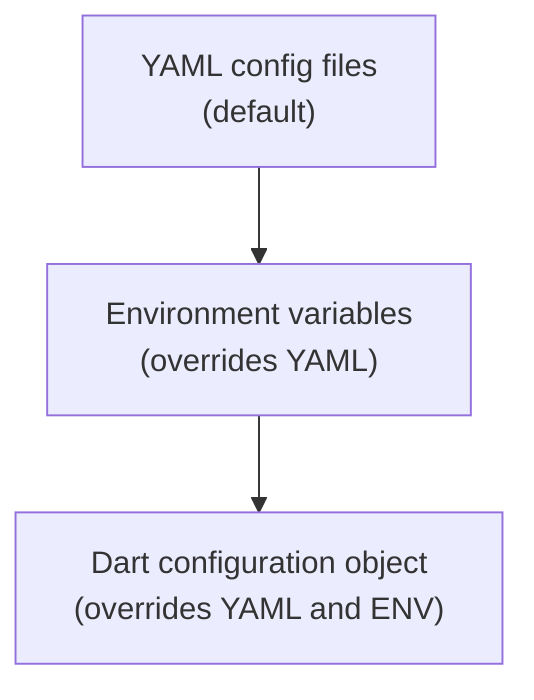

# Configurations

Serverpod can be configured in a few different ways. The minimum required settings to provide is the configuration for the API server. If no settings are provided at all, the default settings for the API server are used.

## Configuration options

There are three different ways to configure Serverpod: with environment variables, via yaml config files, or by supplying the dart configuration object to the Serverpod constructor. The environment variables take precedence over the yaml configurations but both can be used simultaneously. The dart configuration object will override any environment variable or config file. The tables show all available configuration options provided in the Serverpod core library.



### Configuration options for the server

| Environment variable             | Command line option        | Config file option   | Default     | Description                                                                                                      |
| -------------------------------- | -------------------------- | -------------------- | ----------- | ---------------------------------------------------------------------------------------------------------------- |
| SERVERPOD_RUN_MODE               | `--mode`                   | N/A                  | development | Configures the mode of the server instance. Valid options are `development`, `staging`, `production` and `test`. |
| SERVERPOD_SERVER_ID              | `--server-id`              | serverId             | default     | Configures the id of the server instance.                                                                        |
| SERVERPOD_SERVER_ROLE            | `--role`                   | role                 | monolith    | Configures the role of the server instance. Valid options are `monolith`, `serverless` and `maintenance`.        |
| SERVERPOD_LOGGING_MODE           | `--logging`                | logging              | normal      | Configures the logging level. Valid options are `normal`, and `verbose`.                                         |
| SERVERPOD_APPLY_MIGRATIONS       | `--apply-migrations`       | applyMigrations      | false       | Configures if migrations should be applied when the server starts.                                               |
| SERVERPOD_APPLY_REPAIR_MIGRATION | `--apply-repair-migration` | applyRepairMigration | false       | Configures if repair migrations should be applied when the server starts.                                        |

These can be separately declared for each run mode in the corresponding yaml file (`development.yaml`,`staging.yaml`, `production.yaml` and `testing.yaml`) or as environment variables.

| Environment variable                     | Config file                   | Default   | Description                                                                                                                                           |
| ---------------------------------------- | ----------------------------- | --------- | ----------------------------------------------------------------------------------------------------------------------------------------------------- |
| SERVERPOD_API_SERVER_PORT                | apiServer.port                | 8080      | The port number for the API server                                                                                                                    |
| SERVERPOD_API_SERVER_PUBLIC_HOST         | apiServer.publicHost          | localhost | The public host address of the API server                                                                                                             |
| SERVERPOD_API_SERVER_PUBLIC_PORT         | apiServer.publicPort          | 8080      | The public port number for the API server                                                                                                             |
| SERVERPOD_API_SERVER_PUBLIC_SCHEME       | apiServer.publicScheme        | http      | The public scheme (http/https) for the API server                                                                                                     |
| SERVERPOD_INSIGHTS_SERVER_PORT           | insightsServer.port           | -         | The port number for the Insights server                                                                                                               |
| SERVERPOD_INSIGHTS_SERVER_PUBLIC_HOST    | insightsServer.publicHost     | -         | The public host address of the Insights server                                                                                                        |
| SERVERPOD_INSIGHTS_SERVER_PUBLIC_PORT    | insightsServer.publicPort     | -         | The public port number for the Insights server                                                                                                        |
| SERVERPOD_INSIGHTS_SERVER_PUBLIC_SCHEME  | insightsServer.publicScheme   | -         | The public scheme (http/https) for the Insights server                                                                                                |
| SERVERPOD_WEB_SERVER_PORT                | webServer.port                | -         | The port number for the Web server                                                                                                                    |
| SERVERPOD_WEB_SERVER_PUBLIC_HOST         | webServer.publicHost          | -         | The public host address of the Web server                                                                                                             |
| SERVERPOD_WEB_SERVER_PUBLIC_PORT         | webServer.publicPort          | -         | The public port number for the Web server                                                                                                             |
| SERVERPOD_WEB_SERVER_PUBLIC_SCHEME       | webServer.publicScheme        | -         | The public scheme (http/https) for the Web server                                                                                                     |
| SERVERPOD_DATABASE_HOST                  | database.host                 | -         | The host address of the database                                                                                                                      |
| SERVERPOD_DATABASE_PORT                  | database.port                 | -         | The port number for the database connection                                                                                                           |
| SERVERPOD_DATABASE_NAME                  | database.name                 | -         | The name of the database                                                                                                                              |
| SERVERPOD_DATABASE_USER                  | database.user                 | -         | The user name for database authentication                                                                                                             |
| SERVERPOD_DATABASE_SEARCH_PATHS          | database.searchPaths          | -         | The search paths used for all database connections                                                                                                    |
| SERVERPOD_DATABASE_REQUIRE_SSL           | database.requireSsl           | false     | Indicates if SSL is required for the database                                                                                                         |
| SERVERPOD_DATABASE_IS_UNIX_SOCKET        | database.isUnixSocket         | false     | Specifies if the database connection is a Unix socket                                                                                                 |
| SERVERPOD_DATABASE_MAX_CONNECTION_COUNT  | database.maxConnectionCount   | 10        | The maximum number of connections in the database pool. Set to 0 or a negative value for unlimited connections.                                       |
| SERVERPOD_REDIS_HOST                     | redis.host                    | -         | The host address of the Redis server                                                                                                                  |
| SERVERPOD_REDIS_PORT                     | redis.port                    | -         | The port number for the Redis server                                                                                                                  |
| SERVERPOD_REDIS_USER                     | redis.user                    | -         | The user name for Redis authentication                                                                                                                |
| SERVERPOD_REDIS_ENABLED                  | redis.enabled                 | false     | Indicates if Redis is enabled                                                                                                                         |
| SERVERPOD_REDIS_REQUIRE_SSL              | redis.requireSsl              | false     | Indicates if SSL is required for the Redis connection                                                                                                 |
| SERVERPOD_MAX_REQUEST_SIZE               | maxRequestSize                | 524288    | The maximum size of requests allowed in bytes                                                                                                         |
| SERVERPOD_SESSION_PERSISTENT_LOG_ENABLED | sessionLogs.persistentEnabled | -         | Enables or disables logging session data to the database. Defaults to `true` if a database is configured, otherwise `false`.                          |
| SERVERPOD_SESSION_LOG_CLEANUP_INTERVAL   | sessionLogs.cleanupInterval   | 24h       | How often to run the log cleanup job. Duration string (e.g. `24h`, `2d`). Set to null to disable automated purging.                                   |
| SERVERPOD_SESSION_LOG_RETENTION_PERIOD   | sessionLogs.retentionPeriod   | 90d       | How long to keep session log entries. Duration string (e.g. `30d`, `60d`). Set to null to disable time-based cleanup.                                 |
| SERVERPOD_SESSION_LOG_RETENTION_COUNT    | sessionLogs.retentionCount    | 100000    | Maximum number of session log entries to keep. Set to null to disable count-based cleanup.                                                            |
| SERVERPOD_SESSION_CONSOLE_LOG_ENABLED    | sessionLogs.consoleEnabled    | -         | Enables or disables logging session data to the console. Defaults to `true` if no database is configured, otherwise `false`.                          |
| SERVERPOD_SESSION_CONSOLE_LOG_FORMAT     | sessionLogs.consoleLogFormat  | json      | The format for console logging of session data. Valid options are `text` and `json`. Defaults to `text` for run mode `development`, otherwise `json`. |
| SERVERPOD_FUTURE_CALL_EXECUTION_ENABLED  | futureCallExecutionEnabled    | true      | Enables or disables the execution of future calls.                                                                                                    |
| SERVERPOD_FUTURE_CALL_CONCURRENCY_LIMIT  | futureCall.concurrencyLimit   | 1         | The maximum number of concurrent future calls allowed. If the value is negative or null, no limit is applied.                                         |
| SERVERPOD_FUTURE_CALL_SCAN_INTERVAL      | futureCall.scanInterval       | 5000      | The interval in milliseconds for scanning future calls                                                                                                |
| SERVERPOD_WEBSOCKET_PING_INTERVAL        | websocketPingInterval         | 30        | The interval in seconds between WebSocket ping messages sent to keep streaming connections alive. Must be a positive integer.                         |

### Secrets

Secrets are declared in the `passwords.yaml` file. The password file is structured with a common `shared` section, any secret put here will be used in all run modes. The other sections are the names of the run modes followed by respective key/value pairs. You can also define custom secrets using [environment variables](#2-via-environment-variables).

#### Built-in Secrets

The following table shows the built-in secrets that Serverpod uses for its core functionality. These can be configured either through environment variables or by adding the corresponding key in a respective run mode or shared section in the passwords file. These are separate from any custom passwords you might define.

| Environment variable             | Passwords file | Default | Description                                                       |
| -------------------------------- | -------------- | ------- | ----------------------------------------------------------------- |
| SERVERPOD_PASSWORD_database      | database       | -       | The password for the database                                     |
| SERVERPOD_PASSWORD_serviceSecret | serviceSecret  | -       | The token used to connect with insights must be at least 20 chars |
| SERVERPOD_PASSWORD_redis         | redis          | -       | The password for the Redis server                                 |

#### Secrets for First Party Packages

For secrets related to first-party Serverpod packages, see their respective documentation:

- **Cloud storage (GCP/S3)**: [Uploading files](file-uploads)
- **Authentication**: [Authentication Setup](authentication/setup#storing-secrets)

#### Custom Secrets

You can define your own custom secrets in two ways.

##### 1. Via Passwords File

Add your custom secrets directly to the passwords file under the `shared` section (available in all run modes) or under specific run mode sections.

```yaml
shared:
  myCustomSharedSecret: 'secret_key'
  stripeApiKey: 'sk_test_123...'

development:
  database: 'development_password'
  redis: 'development_password'
  serviceSecret: 'development_service_secret'
  twilioApiKey: 'dev_twilio_key'

production:
  database: 'production_password'
  redis: 'production_password'
  serviceSecret: 'production_service_secret'
  twilioApiKey: 'prod_twilio_key'
```

##### 2. Via Environment Variables

You can also define custom passwords using environment variables with the `SERVERPOD_PASSWORD_` prefix. For example, `SERVERPOD_PASSWORD_myApiKey` will be available as `myApiKey` (the prefix is stripped). These environment variables will override any passwords defined in the passwords file if the name (after stripping the prefix) matches. Like the `shared` section in the passwords file, these environment variables are available in all run modes.

| Environment variable format | Description                                                                                                                               |
| --------------------------- | ----------------------------------------------------------------------------------------------------------------------------------------- |
| SERVERPOD_PASSWORD\_\*      | Custom password that will be available in the Session.passwords map. The prefix `SERVERPOD_PASSWORD_` will be stripped from the key name. |

**Example:**

To define a custom password through an environment variable:

```bash
export SERVERPOD_PASSWORD_stripeApiKey=sk_test_123...
```

**Accessing Custom Passwords:**

You can then access any custom password (whether defined in the passwords file or via environment variables) in your endpoint code through the `Session.passwords` map:

```dart
Future<void> processPayment(Session session, PaymentData data) async {
  final stripeApiKey = session.passwords['stripeApiKey'];
  // Use the API key to make requests to Stripe
  ...
}
```

### Config file example

The config file should be named after the run mode you start the server in and it needs to be placed inside the `config` directory in the root of the server project. As an example, you have the `config/development.yaml` that will be used when running in the `development` run mode.

```yaml
apiServer:
  port: 8080
  publicHost: localhost
  publicPort: 8080
  publicScheme: http
  websocketPingInterval: 30

insightsServer:
  port: 8081
  publicHost: localhost
  publicPort: 8081
  publicScheme: http

webServer:
  port: 8082
  publicHost: localhost
  publicPort: 8082
  publicScheme: http

database:
  host: localhost
  port: 8090
  name: database_name
  user: postgres
  maxConnectionCount: 10

redis:
  enabled: false
  host: localhost
  port: 8091

maxRequestSize: 524288

sessionLogs:
  persistentEnabled: true
  cleanupInterval: 24h
  retentionPeriod: 90d
  retentionCount: 100000
  consoleEnabled: true
  consoleLogFormat: json

futureCallExecutionEnabled: true

futureCall:
  concurrencyLimit: 5
  scanInterval: 2000
```

### Passwords file example

The password file contains the secrets used by the server to connect to different services but you can also supply your secrets if you want. This file is structured with a common `shared` section, any secret put here will be used in all run modes. The other sections are the names of the run modes followed by respective key/value pairs.

```yaml
shared:
  myCustomSharedSecret: 'secret_key'

development:
  database: 'development_password'
  redis: 'development_password'
  serviceSecret: 'development_service_secret'
  twilioApiKey: 'dev_twilio_key'

production:
  database: 'production_password'
  redis: 'production_password'
  serviceSecret: 'production_service_secret'
  twilioApiKey: 'prod_twilio_key'
```

### Dart config object example

To configure Serverpod in Dart you simply pass an instance of the `ServerpodConfig` class to the `Serverpod` constructor. This config will override any environment variables or config files present. The `Serverpod` constructor is normally used inside the `run` function in your `server.dart` file. At a minimum, the `apiServer` has to be provided.

```dart
Serverpod(
  args,
  Protocol(),
  Endpoints(),
  config: ServerpodConfig(
    apiServer: ServerConfig(
      port: 8080,
      publicHost: 'localhost',
      publicPort: 8080,
      publicScheme: 'http',
    ),
    insightsServer: ServerConfig(
      port: 8081,
      publicHost: 'localhost',
      publicPort: 8081,
      publicScheme: 'http',
    ),
    webServer: ServerConfig(
      port: 8082,
      publicHost: 'localhost',
      publicPort: 8082,
      publicScheme: 'http',
    ),
  ),
);
```

### Default

If no yaml config files exist, no environment variables are configured and no dart config file is supplied this default configuration will be used.

```dart
ServerpodConfig(
  apiServer: ServerConfig(
    port: 8080,
    publicHost: 'localhost',
    publicPort: 8080,
    publicScheme: 'http',
  ),
);
```

## Code generation configuration

While the above configurations control how your server runs, Serverpod also uses a `generator.yaml` file to configure code generation. This file should be placed in the `config` directory of your server project.

### Generator configuration options

| Option                 | Type   | Default                     | Description                                                                        |
| ---------------------- | ------ | --------------------------- | ---------------------------------------------------------------------------------- |
| type                   | string | server                      | The package type. Valid options are `server`, `module`, or `internal`.             |
| nickname               | string | -                           | For modules only. Defines how the module is referenced in code.                    |
| client_package_path    | string | ../[name]\_client           | Path to the client package relative to the server.                                 |
| server_test_tools_path | string | test/integration/test_tools | Path where test tools are generated. Remove this to disable test tools generation. |
| modules                | map    | -                           | Module dependencies with optional nicknames.                                       |
| extraClasses           | list   | -                           | List of custom serializable classes to include in code generation.                 |
| features               | map    | \{database: true\}          | Feature flags. Currently only `database` is supported.                             |
| experimental_features  | map    | -                           | Experimental features. Available keys: `all`, `inheritance`.                       |

### Package types

The `type` field determines how Serverpod treats your package:

- **server**: A standard Serverpod application (default)
- **module**: A reusable module that can be imported by other Serverpod projects
- **internal**: Internal Serverpod framework packages

For modules, you can also specify a `nickname`:

```yaml
type: module
nickname: auth
```

### Client package path

By default, Serverpod expects the client package to be located at `../[project_name]_client`. You can customize this:

```yaml
client_package_path: ../my_custom_client
```

### Test tools generation

Test tools for integration testing are generated by default at `test/integration/test_tools`. To disable test tools generation, remove the `server_test_tools_path` from your configuration:

```yaml
# Remove or comment out this line to disable test tools
# server_test_tools_path: test/integration/test_tools
```

See the [testing documentation](testing/get-started) for more details.

### Module dependencies

Declare module dependencies and optionally assign nicknames for easier reference:

```yaml
modules:
  serverpod_auth_idp:
    nickname: auth
  my_custom_module:
    nickname: custom
```

This allows you to reference module classes as `module:auth:AuthUser` in your model files. See the [modules documentation](modules) for more information.

### Custom serializable classes

Register custom classes for use in your models:

```yaml
extraClasses:
  - package:my_shared_package/my_shared_package.dart:CustomClass
  - package:my_shared_package/my_shared_package.dart:AnotherCustomClass
```

See the [serialization documentation](serialization) for implementing custom serializable classes.

### Features

Control which Serverpod features are enabled:

```yaml
features:
  database: false # Disables database features
```

### Experimental features

Enable experimental features that are still in development:

```yaml
experimental_features:
  inheritance: true # Enables class inheritance in model files
  # or
  all: true # Enables all experimental features
```

Available experimental features:

- `inheritance`: Enables the `extends` keyword in model files for class inheritance
- `all`: Enables all available experimental features

See the [experimental features documentation](experimental) for detailed information about each feature.

:::warning
Experimental features may change or be removed in future versions.
:::
