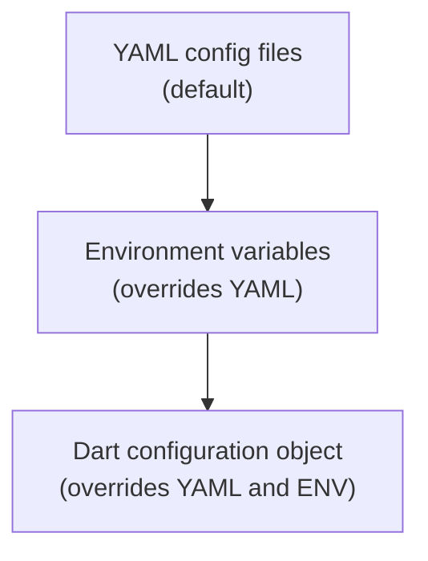

# Configurations

Serverpod can be configured in a few different ways. The minimum required settings to provide is the configuration for the API server. If no settings are provided at all, the default settings for the API server are used.

## Configuration options

There are three different ways to configure Serverpod: with environment variables, via yaml config files, or by supplying the dart configuration object to the Serverpod constructor. The environment variables take precedence over the yaml configurations but both can be used simultaneously. The dart configuration object will override any environment variable or config file. The tables show all available configuration options provided in the Serverpod core library.



### Configuration options for the server

These can be separately declared for each run mode in the corresponding yaml file (`development.yaml`,`staging.yaml`, `production.yaml` and `testing.yaml`) or as environment variables.

| Environment variable                     | Config file                   | Default   | Description                                                                                                                  |
| ---------------------------------------- | ----------------------------- | --------- | ---------------------------------------------------------------------------------------------------------------------------- |
| SERVERPOD_API_SERVER_PORT                | apiServer.port                | 8080      | The port number for the API server                                                                                           |
| SERVERPOD_API_SERVER_PUBLIC_HOST         | apiServer.publicHost          | localhost | The public host address of the API server                                                                                    |
| SERVERPOD_API_SERVER_PUBLIC_PORT         | apiServer.publicPort          | 8080      | The public port number for the API server                                                                                    |
| SERVERPOD_API_SERVER_PUBLIC_SCHEME       | apiServer.publicScheme        | http      | The public scheme (http/https) for the API server                                                                            |
| SERVERPOD_INSIGHTS_SERVER_PORT           | insightsServer.port           | -         | The port number for the Insights server                                                                                      |
| SERVERPOD_INSIGHTS_SERVER_PUBLIC_HOST    | insightsServer.publicHost     | -         | The public host address of the Insights server                                                                               |
| SERVERPOD_INSIGHTS_SERVER_PUBLIC_PORT    | insightsServer.publicPort     | -         | The public port number for the Insights server                                                                               |
| SERVERPOD_INSIGHTS_SERVER_PUBLIC_SCHEME  | insightsServer.publicScheme   | -         | The public scheme (http/https) for the Insights server                                                                       |
| SERVERPOD_WEB_SERVER_PORT                | webServer.port                | -         | The port number for the Web server                                                                                           |
| SERVERPOD_WEB_SERVER_PUBLIC_HOST         | webServer.publicHost          | -         | The public host address of the Web server                                                                                    |
| SERVERPOD_WEB_SERVER_PUBLIC_PORT         | webServer.publicPort          | -         | The public port number for the Web server                                                                                    |
| SERVERPOD_WEB_SERVER_PUBLIC_SCHEME       | webServer.publicScheme        | -         | The public scheme (http/https) for the Web server                                                                            |
| SERVERPOD_DATABASE_HOST                  | database.host                 | -         | The host address of the database                                                                                             |
| SERVERPOD_DATABASE_PORT                  | database.port                 | -         | The port number for the database connection                                                                                  |
| SERVERPOD_DATABASE_NAME                  | database.name                 | -         | The name of the database                                                                                                     |
| SERVERPOD_DATABASE_USER                  | database.user                 | -         | The user name for database authentication                                                                                    |
| SERVERPOD_DATABASE_SEARCH_PATHS          | database.searchPaths          | -         | The search paths used for all database connections                                                                           |
| SERVERPOD_DATABASE_REQUIRE_SSL           | database.requireSsl           | false     | Indicates if SSL is required for the database                                                                                |
| SERVERPOD_DATABASE_IS_UNIX_SOCKET        | database.isUnixSocket         | false     | Specifies if the database connection is a Unix socket                                                                        |
| SERVERPOD_REDIS_HOST                     | redis.host                    | -         | The host address of the Redis server                                                                                         |
| SERVERPOD_REDIS_PORT                     | redis.port                    | -         | The port number for the Redis server                                                                                         |
| SERVERPOD_REDIS_USER                     | redis.user                    | -         | The user name for Redis authentication                                                                                       |
| SERVERPOD_REDIS_ENABLED                  | redis.enabled                 | false     | Indicates if Redis is enabled                                                                                                |
| SERVERPOD_MAX_REQUEST_SIZE               | maxRequestSize                | 524288    | The maximum size of requests allowed in bytes                                                                                |
| SERVERPOD_SESSION_PERSISTENT_LOG_ENABLED | sessionLogs.persistentEnabled | -         | Enables or disables logging session data to the database. Defaults to `true` if a database is configured, otherwise `false`. |
| SERVERPOD_SESSION_CONSOLE_LOG_ENABLED    | sessionLogs.consoleEnabled    | -         | Enables or disables logging session data to the console. Defaults to `true` if no database is configured, otherwise `false`. |
| SERVERPOD_FUTURE_CALL_EXECUTION_ENABLED  | futureCallExecutionEnabled    | true      | Enables or disables the execution of future calls.                                                                           |
| SERVERPOD_FUTURE_CALL_CONCURRENCY_LIMIT  | futureCall.concurrencyLimit   | 1         | The maximum number of concurrent future calls allowed. If the value is negative or null, no limit is applied.                |
| SERVERPOD_FUTURE_CALL_SCAN_INTERVAL      | futureCall.scanInterval       | 5000      | The interval in milliseconds for scanning future calls                                                                       |

| Environment variable | Command line option | Default | Description                               |
| -------------------- | ------------------- | ------- | ----------------------------------------- |
| SERVERPOD_SERVER_ID  | `--server-id`       | default | Configures the id of the server instance. |

### Secrets

Secrets are declared in the `passwords.yaml` file. The password file is structured with a common `shared` section, any secret put here will be used in all run modes. The other sections are the names of the run modes followed by respective key/value pairs.

| Environment variable        | Passwords file | Default | Description                                                       |
| --------------------------- | -------------- | ------- | ----------------------------------------------------------------- |
| SERVERPOD_DATABASE_PASSWORD | database       | -       | The password for the database                                     |
| SERVERPOD_SERVICE_SECRET    | serviceSecret  | -       | The token used to connect with insights must be at least 20 chars |
| SERVERPOD_REDIS_PASSWORD    | redis          | -       | The password for the Redis server                                 |

#### Secrets for first party packages

- [serverpod_cloud_storage_gcp](https://pub.dev/packages/serverpod_cloud_storage_gcp): Google Cloud Storage
- [serverpod_cloud_storage_s3](https://pub.dev/packages/serverpod_cloud_storage_s3): Amazon S3

| Environment variable         | Passwords file  | Default | Description                                                               |
| ---------------------------- | --------------- | ------- | ------------------------------------------------------------------------- |
| SERVERPOD_HMAC_ACCESS_KEY_ID | HMACAccessKeyId | -       | The access key ID for HMAC authentication for serverpod_cloud_storage_gcp |
| SERVERPOD_HMAC_SECRET_KEY    | HMACSecretKey   | -       | The secret key for HMAC authentication for serverpod_cloud_storage_gcp    |
| SERVERPOD_AWS_ACCESS_KEY_ID  | AWSAccessKeyId  | -       | The access key ID for AWS authentication for serverpod_cloud_storage_s3   |
| SERVERPOD_AWS_SECRET_KEY     | AWSSecretKey    | -       | The secret key for AWS authentication for serverpod_cloud_storage_s3      |

### Config file example

The config file should be named after the run mode you start the server in and it needs to be placed inside the `config` directory in the root of the server project. As an example, you have the `config/development.yaml` that will be used when running in the `development` run mode.

```yaml
apiServer:
  port: 8080
  publicHost: localhost
  publicPort: 8080
  publicScheme: http

insightsServer:
  port: 8081
  publicHost: localhost
  publicPort: 8081
  publicScheme: http

webServer:
  port: 8082
  publicHost: localhost
  publicPort: 8082
  publicScheme: http

database:
  host: localhost
  port: 8090
  name: database_name
  user: postgres

redis:
  enabled: false
  host: localhost
  port: 8091

maxRequestSize: 524288

sessionLogs:
  persistentEnabled: true
  consoleEnabled: true

futureCallExecutionEnabled: true

futureCall:
  concurrencyLimit: 5
  scanInterval: 2000
```

### Passwords file example

The password file contains the secrets used by the server to connect to different services but you can also supply your secrets if you want. This file is structured with a common `shared` section, any secret put here will be used in all run modes. The other sections are the names of the run modes followed by respective key/value pairs.

```yaml
shared:
  myCustomSharedSecret: 'secret_key'

development:
  database: 'development_password'
  redis: 'development_password'
  serviceSecret: 'development_service_secret'

production:
  database: 'production_password'
  redis: 'production_password'
  serviceSecret: 'production_service_secret'
```

### Dart config object example

To configure Serverpod in Dart you simply pass an instance of the `ServerpodConfig` class to the `Serverpod` constructor. This config will override any environment variables or config files present. The `Serverpod` constructor is normally used inside the `run` function in your `server.dart` file. At a minimum, the `apiServer` has to be provided.

```dart
Serverpod(
  args,
  Protocol(),
  Endpoints(),
  config: ServerpodConfig(
    apiServer: ServerConfig(
      port: 8080,
      publicHost: 'localhost',
      publicPort: 8080,
      publicScheme: 'http',
    ),
    insightsServer: ServerConfig(
      port: 8081,
      publicHost: 'localhost',
      publicPort: 8081,
      publicScheme: 'http',
    ),
    webServer: ServerConfig(
      port: 8082,
      publicHost: 'localhost',
      publicPort: 8082,
      publicScheme: 'http',
    ),
  ),
);
```

### Default

If no yaml config files exist, no environment variables are configured and no dart config file is supplied this default configuration will be used.

```dart
ServerpodConfig(
  apiServer: ServerConfig(
    port: 8080,
    publicHost: 'localhost',
    publicPort: 8080,
    publicScheme: 'http',
  ),
);
```
