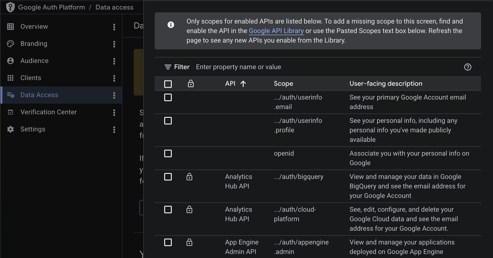
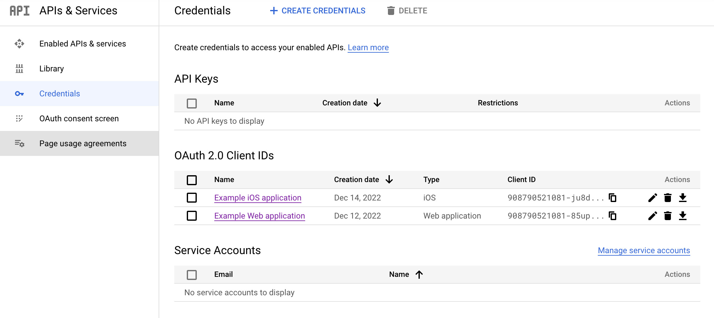

# Setup

To set up Sign in with Google, you will need a Google account for your organization and set up a new project. For the project, you need to set up _Credentials_ and _OAuth consent screen_. You will also need to add the `serverpod_auth_idp_flutter` package to your app and do some additional setup depending on each platform.

:::note
Right now, we have official support for iOS, Android, and Web for Google Sign In.
:::

:::caution
You need to install the auth module before you continue, see [Setup](../../setup).
:::

## Create your credentials

To implement Google Sign In, you need a Google Cloud project. You can create one in the [Google Cloud Console](https://console.cloud.google.com/).

### Enable People API

To be allowed to access user data and use the authentication method in Serverpod we have to enable the People API in our project.

[Enable it here](https://console.cloud.google.com/apis/library/people.googleapis.com) or find it yourself by navigating to the _Library_ section under _APIs & Services_. Search for _Google People API_, select it, and click on _Enable_.

### Setup OAuth consent screen

The setup for the OAuth consent screen can be found [here](https://console.cloud.google.com/apis/credentials/consent) or under _APIs & Services_ > _OAuth consent screen_.

1. Fill in all the required information, for production use you need a domain that adds under `Authorized` domains.

2. Add the scopes `.../auth/userinfo.email` and `.../auth/userinfo.profile`.

3. Add your email to the test users so that you can test your integration in development mode.



## Server-side configuration

Create the server credentials in the Google Cloud Console. Navigate to _Credentials_ under _APIs & Services_. Click _Create Credentials_ and select _OAuth client ID_. Configure the OAuth client as a _**Web application**_. If you have a domain add it to the `Authorized JavaScript origins` and `Authorized redirect URIs`. For development purposes we can add `http://localhost:8082` to both fields, this is the address to the web server.



Download the JSON file for your web application OAuth client. This file contains both the client id and the client secret. You will need to supply the contents of the file to the `clientSecret` property of the `GoogleIdpConfig` object.

This can be done by pasting the contents of the JSON file into the `googleClientSecret` key in the `config/passwords.yaml` file or setting as value of the `SERVERPOD_PASSWORD_googleClientSecret` environment variable. Alternatively, you can read the file contents directly using the `GoogleClientSecret.fromJsonFile()` method.

In your main `server.dart` file, configure the Google identity provider:

```dart
import 'package:serverpod/serverpod.dart';
import 'package:serverpod_auth_idp_server/core.dart';
import 'package:serverpod_auth_idp_server/providers/google.dart';

void run(List<String> args) async {
  final pod = Serverpod(
    args,
    Protocol(),
    Endpoints(),
  );

  pod.initializeAuthServices(
    tokenManagerBuilders: [
      JwtConfigFromPasswords(),
    ],
    identityProviderBuilders: [
      GoogleIdpConfig(
        clientSecret: GoogleClientSecret.fromJsonString(
          pod.getPassword('googleClientSecret')!,
        ),
      ),
    ],
  );

  await pod.start();
}
```

:::tip
You can use the `GoogleIdpConfigFromPasswords` constructor in replacement of the `GoogleIdpConfig` above to automatically load the client secret from the `config/passwords.yaml` file or environment variables. It will expect the `googleClientSecret` key on the file or the `SERVERPOD_PASSWORD_googleClientSecret` environment variable.
:::

Then, extend the abstract endpoint to expose it on the server:

```dart
import 'package:serverpod_auth_idp_server/providers/google.dart';

class GoogleIdpEndpoint extends GoogleIdpBaseEndpoint {}
```

Finally, run `serverpod generate` to generate the client code and create a migration to initialize the database for the provider. More detailed instructions can be found in the general [identity providers setup section](../../01-setup#identity-providers-configuration).

### Basic configuration options

- `clientSecret`: Required. Google OAuth client secret loaded from JSON. See the [configuration section](./02-configuration) for details on different ways to load the client secret.

For more details on configuration options, such as customizing account validation, accessing Google APIs, and more, see the [configuration section](./02-configuration).

:::warning
The `google_client_secret.json` contains a private key and should not be version controlled. Store it securely using environment variables or secret management.
:::

## Client-side configuration

For our client-side configurations, we have to first create client-side credentials and include the credentials files in our projects. The Android and iOS integrations use the [google_sign_in](https://pub.dev/packages/google_sign_in) package under the hood, so any documentation there should also apply to this setup.

### iOS

Create the client credentials. Navigate to _Credentials_ under _APIs & Services_. Click _Create Credentials_ and select _OAuth client ID_. Configure the OAuth client as Application type _**iOS**_.

Fill in all the required information, and create the credentials. Then download the `plist` file rename it to `GoogleService-Info.plist` and put it inside your ios project folder. Then drag and drop it into your XCode project to include the file in your build.

Open the `GoogleService-Info.plist` in your editor and add the SERVER_CLIENT_ID if it does not exist:

```xml
<dict>
  ...
  <key>SERVER_CLIENT_ID</key>
  <string>your_server_client_id</string>
</dict>
```

Replace `your_server_client_id` with the client id from the JSON file you put inside the config folder in the server.

#### Add the URL scheme

To allow us to navigate back to the app after the user has signed in we have to add the URL Scheme, the scheme is the reversed client ID of your iOS app. You can find it inside the `GoogleService-Info.plist` file.

Open the `info.plist` file in your editor and add the following to register the URL Scheme.

```xml
<dict>
  ...
  <key>CFBundleURLTypes</key>
  <array>
    <dict>
      <key>CFBundleTypeRole</key>
      <string>Editor</string>
      <key>CFBundleURLSchemes</key>
      <array>
        <string>your_reversed_client_id</string>
      </array>
    </dict>
  </array>
</dict>
```

Replace `your_reversed_client_id` with your reversed client ID.

:::info
If you have any social logins in your app you also need to integrate "Sign in with Apple" to publish your app to the app store. ([Read more](https://developer.apple.com/sign-in-with-apple/get-started/)).
:::

### Android

Create the client credentials. Navigate to _Credentials_ under _APIs & Services_. Click _Create Credentials_ and select _OAuth client ID_. Configure the OAuth client as Application type _**Android**_.

Fill in all required information, you can get the debug SHA-1 hash by running `./gradlew signingReport` in your Android project directory. Create the credentials and download the JSON file.

Put the file inside the `android/app/` directory and rename it to `google-services.json`.

:::info
For a production app you need to get the SHA-1 key from your production keystore! This can be done by running this command: ([Read more](https://support.google.com/cloud/answer/6158849#installedapplications&android&zippy=%2Cnative-applications%2Candroid)).

```bash
$ keytool -list -v -keystore /path/to/keystore
```
:::

### Web

There is no need to create any client credentials for the web, since it uses the same client ID as the server. However, you have to modify the server credentials inside the Google Cloud Console.

Navigate to _Credentials_ under _APIs & Services_ and select the server credentials. Under `Authorized JavaScript origins` and `Authorized redirect URIs` add the domain for your Flutter app, for development, this is `http://localhost:<port>` where the port is the port you are using.

:::info
Force flutter to run on a specific port by running.

```bash
$ flutter run -d chrome --web-port=49660
```
:::

Set up the actual redirect URI where the user will navigate after the sign-in. You can choose any path you want but it has to be the same in the credentials, your server, and Flutter configurations.

For example, using the path `/googlesignin`.

For development inside `Authorized redirect URIs` add `http://localhost:8082/googlesignin`, in production use `https://example.com/googlesignin`.

Then, on the `web/index.html` file, add the following to the `<head>` section:

```html
<head>
  ...
  <meta name="google-signin-client_id" content="your_server_client_id">
</head>
```


## Present the authentication UI

### Initializing the `GoogleSignInService`

To use the GoogleSignInService, you need to initialize it in your main function. The initialization is done from the `initializeGoogleSignIn()` extension method on the `FlutterAuthSessionManager`.

```dart
import 'package:serverpod_auth_idp_flutter/serverpod_auth_idp_flutter.dart';
import 'package:your_client/your_client.dart';

final client = Client('http://localhost:8080/')
  ..authSessionManager = FlutterAuthSessionManager();

void main() {
  client.auth.initialize();
  client.auth.initializeGoogleSignIn();
}
```

### Using GoogleSignInWidget

If you have configured the `SignInWidget` as described in the [setup section](../../01-setup#present-the-authentication-ui), the Google identity provider will be automatically detected and displayed in the sign-in widget.

You can also use the `GoogleSignInWidget` to include the Google authentication flow in your own custom UI.

```dart
import 'package:serverpod_auth_idp_flutter/serverpod_auth_idp_flutter.dart';

GoogleSignInWidget(
  client: client,
  onAuthenticated: () {
    // Navigate to home screen or update UI
    Navigator.of(context).pushReplacement(
      MaterialPageRoute(builder: (_) => HomePage()),
    );
  },
  onError: (error) {
    // Handle errors
    ScaffoldMessenger.of(context).showSnackBar(
      SnackBar(content: Text('Error: $error')),
    );
  },
)
```

The widget automatically handles:
- Google Sign-In flow for iOS, Android, and Web.
- Lightweight sign-in (One Tap, FedCM) support.
- Token management.
- Underlying Google Sign-In package error handling.

For details on how to customize the Google Sign-In UI in your Flutter app, see the [customizing the UI section](./03-customizing-the-ui).
