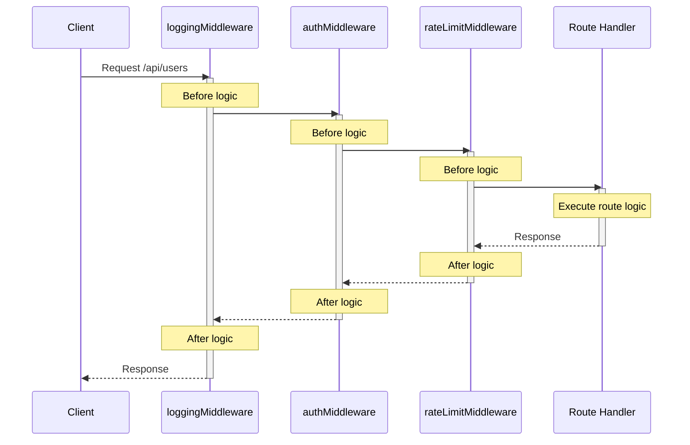

# Middleware

Routes handle the core logic of your application, but many concerns cut across
multiple routes: logging every request, validating API keys, handling CORS
headers, or catching errors. Rather than duplicating this code in each route,
middleware lets you apply it globally or to specific path prefixes.

Middleware functions are wrappers that sit between the incoming request and your
route handler. They can inspect or modify requests before they reach your
routes, and transform responses before they're sent back to the client. This
makes middleware perfect for authentication, logging, error handling, and any
other cross-cutting concern in your web server.

## Adding middleware

Use the `addMiddleware` method to apply middleware to specific path prefixes:

```dart
// Apply to all routes
pod.webServer.addMiddleware(loggingMiddleware, '/');

// Apply only to API routes
pod.webServer.addMiddleware(authMiddleware, '/api');
```

## Creating custom middleware

Middleware is a function that takes a `Handler` and returns a new `Handler`.
Here's a simple logging middleware example:

```dart
Handler loggingMiddleware(Handler innerHandler) {
  return (Request request) async {
    final start = DateTime.now();
    print('→ ${request.method.name.toUpperCase()} ${request.url.path}');

    // Call the next handler in the chain
    final response = await innerHandler(request);

    final duration = DateTime.now().difference(start);
    print('← ${response.statusCode} (${duration.inMilliseconds}ms)');

    return response;
  };
}
```

## Api key validation middleware

A common use case is validating API keys for protected routes:

```dart
Handler apiKeyMiddleware(Handler innerHandler) {
  return (Request request) async {
    // Check for API key in header
    final apiKey = request.headers['X-API-Key']?.firstOrNull;

    if (apiKey == null) {
      return Response.unauthorized(
        body: Body.fromString('API key required'),
      );
    }

    // Verify API key
    if (!await isValidApiKey(apiKey)) {
      return Response.forbidden(
        body: Body.fromString('Invalid API key'),
      );
    }

    // Continue to the next handler
    return await innerHandler(request);
  };
}

// Apply to protected routes
pod.webServer.addMiddleware(apiKeyMiddleware, '/api');
```

:::info

For user authentication, use Serverpod's built-in authentication system which
integrates with the `Session` object. The middleware examples here are for
additional web-specific validations like API keys, rate limiting, or request
validation.

:::

## Cors middleware

Enable Cross-Origin Resource Sharing for your API:

```dart
Handler corsMiddleware(Handler innerHandler) {
  return (Request request) async {
    // Handle preflight requests
    if (request.method == Method.options) {
      return Response.ok(
        headers: Headers.build((h) {
          h.accessControlAllowOrigin = const AccessControlAllowOriginHeader.wildcard();
          h.accessControlAllowMethods = AccessControlAllowMethodsHeader.methods(
            methods: [Method.get, Method.post, Method.put, Method.delete],
          );
          h.accessControlAllowHeaders = AccessControlAllowHeadersHeader.headers(
            headers: ['Content-Type', 'Authorization'],
          );
        }),
      );
    }

    // Process the request
    final response = await innerHandler(request);

    // Add CORS headers to response
    return response.copyWith(
      headers: response.headers.transform((h) {
        h.accessControlAllowOrigin = const AccessControlAllowOriginHeader.wildcard();
      }),
    );
  };
}

pod.webServer.addMiddleware(corsMiddleware, '/api');
```

## Error handling

Production applications need robust error handling. Rather than adding try-catch
blocks to every route, use error-handling middleware to catch exceptions
globally and return consistent error responses.

### Error-handling middleware

Error-handling middleware wraps all your routes and catches any exceptions they
throw:

```dart
Handler errorHandlingMiddleware(Handler innerHandler) {
  return (Request request) async {
    try {
      return await innerHandler(request);
    } on FormatException catch (e) {
      // Handle JSON parsing errors
      return Response.badRequest(
        body: Body.fromString(
          jsonEncode({'error': 'Invalid request format', 'message': e.message}),
          mimeType: MimeType.json,
        ),
      );
    } catch (e, stackTrace) {
      // Log the error
      print('Error handling ${request.method} ${request.url.path}: $e');
      print(stackTrace);

      // Return a generic error response
      return Response.internalServerError(
        body: Body.fromString(
          jsonEncode({'error': 'Internal server error'}),
          mimeType: MimeType.json,
        ),
      );
    }
  };
}

// Apply to all routes
pod.webServer.addMiddleware(errorHandlingMiddleware, '/');
```

With error-handling middleware in place, your route handlers can focus on
business logic without extensive try-catch blocks. The middleware catches common
exceptions like:

- `FormatException` from `jsonDecode()` - Returns 400 Bad Request
- Database errors - Returns 500 Internal Server Error with logging
- Any other uncaught exceptions - Returns 500 with error details logged

If an exception escapes all middleware, Serverpod will automatically return a
500 Internal Server Error response. However, using error-handling middleware
gives you control over error responses and logging.

## Middleware execution order

Middleware is applied based on path hierarchy, with more specific paths taking
precedence. Within the same path, middleware executes in the order it was
registered:

```dart
pod.webServer.addMiddleware(loggingMiddleware, '/');      // Executes first (outer)
pod.webServer.addMiddleware(authMiddleware, '/api');      // Executes second (inner) for /api routes
pod.webServer.addMiddleware(rateLimitMiddleware, '/api'); // Executes third (innermost) for /api routes
```

For a request to `/api/users`, the execution order is:



## Request-scoped data with contextproperty

Middleware often needs to pass computed data to downstream handlers. For
example, a tenant identification middleware might extract the tenant ID from a
subdomain, or a logging middleware might generate a request ID for tracing.
Since `Request` objects are immutable, you can't just add properties to them.
This is where `ContextProperty` comes in.

`ContextProperty<T>` provides a type-safe way to attach data to a `Request`
object without modifying it. Think of it as a side channel for request-scoped
data that middleware can write to and routes can read from. The data is
automatically cleaned up when the request completes, making it perfect for
per-request state.

:::info

Note that Serverpod's `Route.handleCall()` already receives a `Session` parameter
which includes authenticated user information if available. Use `ContextProperty`
for web-specific request data that isn't part of the standard Session, such as
request IDs, feature flags, or API version information extracted from headers.

:::

### Why use contextproperty?

Since `Request` objects are immutable, you can't modify them directly.
`ContextProperty` allows you to associate additional data with a request that
can be accessed by all downstream middleware and handlers. Common use cases
include:

- **Request ID tracking** - Generated correlation IDs for distributed tracing
  (purely request-scoped, not session data)
- **API versioning** - Extract and store API version from headers
- **Feature flags** - Request-specific toggles based on headers or A/B testing
- **Rate limiting** - Per-request rate limit state
- **Tenant identification** - Multi-tenant context from subdomains (when not
  part of user session)

### Creating a contextproperty

Define a `ContextProperty` as a top-level constant or static field:

```dart
// Define a property for request ID tracking
final requestIdProperty = ContextProperty<String>('requestId');

// Define a property for tenant identification
final tenantProperty = ContextProperty<String>('tenant');

// Optional: with a default value
final featureFlagsProperty = ContextProperty<FeatureFlags>(
  'featureFlags',
  defaultValue: () => FeatureFlags.defaults(),
);
```

### Setting values in middleware

Middleware can set values on the context property, making them available to all
downstream handlers:

```dart
final requestIdProperty = ContextProperty<String>('requestId');

Handler requestIdMiddleware(Handler innerHandler) {
  return (Request request) async {
    // Generate a unique request ID for tracing
    final requestId = Uuid().v4();

    // Attach to request context
    requestIdProperty[request] = requestId;

    // Log the incoming request
    print('[$requestId] ${request.method} ${request.url.path}');

    // Continue to next handler
    final response = await innerHandler(request);

    // Log the response
    print('[$requestId] Response: ${response.statusCode}');

    // Optionally add request ID to response headers
    return response.copyWith(
      headers: response.headers.transform((h) {
        h['X-Request-ID'] = [requestId];
      }),
    );
  };
}
```

### Accessing values in routes

Route handlers can retrieve the value from the context property:

```dart
class ApiRoute extends Route {
  @override
  Future<Result> handleCall(Session session, Request request) async {
    // Get the request ID from context
    final requestId = requestIdProperty[request];

    // Use it for logging or tracing
    session.log('Processing request $requestId');

    // Your route logic here
    final data = await processRequest(session);

    return Response.ok(
      body: Body.fromString(
        jsonEncode(data),
        mimeType: MimeType.json,
      ),
    );
  }
}
```

### Safe access with getornull

If a value might not be set, use `getOrNull()` to avoid exceptions:

```dart
class TenantRoute extends Route {
  @override
  Future<Result> handleCall(Session session, Request request) async {
    // Safely get tenant, returns null if not set
    final tenant = tenantProperty.getOrNull(request);

    if (tenant != null) {
      // Fetch tenant-specific data
      final data = await session.db.find<Data>(where: (t) => t.tenantId.equals(tenant));
      return Response.ok(
        body: Body.fromString(jsonEncode(data), mimeType: MimeType.json),
      );
    } else {
      return Response.badRequest(
        body: Body.fromString('Missing tenant identifier'),
      );
    }
  }
}
```

### Complete multi-tenant example

Here's a complete example showing tenant identification from subdomains:

```dart
// Define the context property for tenant ID
final tenantProperty = ContextProperty<String>('tenant');

// Tenant identification middleware (extracts from subdomain)
Handler tenantMiddleware(Handler innerHandler) {
  return (Request request) async {
    final host = request.headers.host;

    if (host == null) {
      return Response.badRequest(
        body: Body.fromString('Missing host header'),
      );
    }

    // Extract tenant from subdomain (e.g., acme.example.com -> "acme")
    final parts = host.host.split('.');
    if (parts.length < 2) {
      return Response.badRequest(
        body: Body.fromString('Invalid hostname format'),
      );
    }

    final tenant = parts.first;

    // Validate tenant exists (implement your own logic)
    final session = request.session;
    final tenantExists = await validateTenant(session, tenant);

    if (!tenantExists) {
      return Response.notFound(
        body: Body.fromString('Tenant not found'),
      );
    }

    // Attach tenant to context
    tenantProperty[request] = tenant;

    return await innerHandler(request);
  };
}

// Usage in your server
pod.webServer.addMiddleware(tenantMiddleware, '/');

// Routes automatically have access to the tenant
class TenantDataRoute extends Route {
  @override
  Future<Result> handleCall(Session session, Request request) async {
    final tenant = tenantProperty[request];

    // Fetch tenant-specific data
    final data = await session.db.find<Product>(
      where: (p) => p.tenantId.equals(tenant),
    );

    return Response.ok(
      body: Body.fromString(
        jsonEncode(data.map((p) => p.toJson()).toList()),
        mimeType: MimeType.json,
      ),
    );
  }
}
```

### Multiple context properties

You can use multiple context properties for different types of data:

```dart
final requestIdProperty = ContextProperty<String>('requestId');
final tenantProperty = ContextProperty<String>('tenant');
final apiVersionProperty = ContextProperty<String>('apiVersion');

Handler requestContextMiddleware(Handler innerHandler) {
  return (Request request) async {
    // Generate and attach request ID
    final requestId = Uuid().v4();
    requestIdProperty[request] = requestId;

    // Extract tenant from subdomain or header
    final host = request.headers.host;
    if (host != null) {
      final tenant = host.host.split('.').first;
      tenantProperty[request] = tenant;
    }

    // Extract API version from header
    final apiVersion = request.headers['X-API-Version']?.firstOrNull ?? '1.0';
    apiVersionProperty[request] = apiVersion;

    return await innerHandler(request);
  };
}

// Later in your route
class DataRoute extends Route {
  @override
  Future<Result> handleCall(Session session, Request request) async {
    final requestId = requestIdProperty[request];
    final tenant = tenantProperty[request];
    final apiVersion = apiVersionProperty[request];

    session.log('Request $requestId for tenant $tenant (API v$apiVersion)');

    // Fetch tenant-specific data
    final data = await fetchTenantData(session, tenant);

    return Response.ok(
      body: Body.fromString(jsonEncode(data), mimeType: MimeType.json),
    );
  }
}
```

## Next steps

- Serve [static files](static-files) with caching and compression
- Use [typed headers](typed-headers) for type-safe header access
- Learn about [modular routes](modular-routes) for organizing complex APIs
