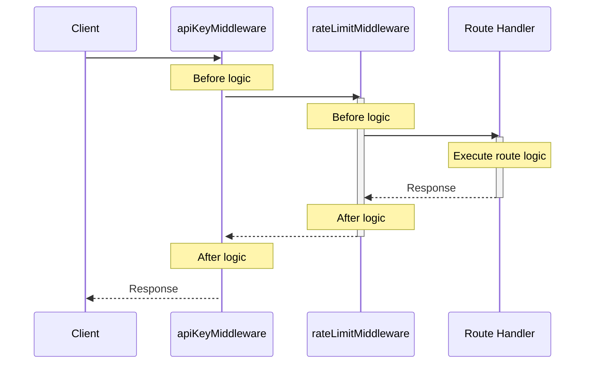

# Middleware

Routes handle the core logic of your application, but many concerns cut across
multiple routes: logging every request, validating API keys, handling CORS
headers, or catching errors. Rather than duplicating this code in each route,
middleware lets you apply it globally or to specific path prefixes.

Middleware functions are wrappers that sit between the incoming request and your
route handler. They can inspect or modify requests before they reach your
routes, and transform responses before they're sent back to the client. This
makes middleware perfect for authentication, logging, error handling, and any
other cross-cutting concern in your web server.

## Adding middleware

Use the `addMiddleware` method to apply middleware to specific path prefixes:

```dart
// Apply to all routes below `/path`
pod.webServer.addMiddleware(myMiddleware, '/path');
```

## Creating custom middleware

Middleware is a function that takes a `Handler` and returns a new `Handler`.
Here's a simple example that validates API keys for protected routes:

```dart
Handler apiKeyMiddleware(Handler next) {
  return (Request request) async {
    // Check for API key in header
    final apiKey = request.headers['X-API-Key']?.firstOrNull;

    if (apiKey == null) {
      return Response.unauthorized(
        body: Body.fromString('API key required'),
      );
    }

    // Verify API key
    if (!await isValidApiKey(apiKey)) {
      return Response.forbidden(
        body: Body.fromString('Invalid API key'),
      );
    }

    // Continue to the next handler
    return await next(request);
  };
}

// Apply to protected routes
pod.webServer.addMiddleware(apiKeyMiddleware, '/api');
```

:::info
For user authentication, use Serverpod's built-in authentication system which
integrates with the `Session` object. The middleware examples here are for
additional web-specific validations like API keys, rate limiting, or request
validation.

:::

## Middleware execution order

Middleware is applied based on path hierarchy, with more specific paths taking
precedence. Within the same path, middleware executes in the order it was
registered:

```dart
pod.webServer.addMiddleware(rateLimitMiddleware, '/api/users'); // Executes last for /api (inner)
pod.webServer.addMiddleware(apiKeyMiddleware, '/api');          // Executes first for /api (outer)
```

For a request to `/api/users/list`, the execution order is:



## Request-scoped data

Middleware often needs to pass computed data to downstream handlers. For
example, a tenant identification middleware might extract the tenant ID from a
subdomain, or a logging middleware might generate a request ID for tracing.
Since `Request` objects are immutable, you can't just add properties to them.
This is where `ContextProperty` comes in.

`ContextProperty<T>` provides a type-safe way to attach data to a `Request`
object without modifying it. Think of it as a side channel for request-scoped
data that middleware can write to and routes can read from. The data is
automatically cleaned up when the request completes, making it perfect for
per-request state. For more details, see the [Relic documentation](https://docs.dartrelic.dev/).

:::info

Note that Serverpod's `Route.handleCall()` already receives a `Session` parameter
which includes authenticated user information if available. Use `ContextProperty`
for web-specific request data that isn't part of the standard Session, such as
request IDs, feature flags, or API version information extracted from headers.

:::

### Creating a `ContextProperty`

Define a `ContextProperty` as a top-level static field:

```dart
// Define a private context property.
final _tenantProperty = ContextProperty<String>('tenant');

// Create a public getter extension to allow handlers and other middleware to
// read, but not modify the context property.
extension tenantPropertyEx on Request {
  String get tenant => _tenantProperty.get(this); // get throw on null, [] doesn't  
}
```

### Setting values in middleware

Middleware can set values on the context property, making them available to all
downstream handlers:

```dart
// in same file
 
// Tenant identification middleware (extracts from subdomain)
Handler tenantMiddleware(Handler next) {
  return (Request request) async {
    final host = request.headers.host;

    // Validate tenant exists (implement your own logic)
    final session = request.session;
    final tenant = await extractAndValidateTenant(session, host);

    if (tenant == null) {
      return Response.notFound(
        body: Body.fromString('Tenant not found'),
      );
    }

    // Attach tenant to context
    _tenantProperty[request] = tenant;

    return await next(request);
  };
}
```

### Accessing values in routes

Route handlers can retrieve the value from the context property:

```dart
// Routes automatically have access to the tenant
class TenantDataRoute extends Route {
  @override
  Future<Result> handleCall(Session session, Request request) async {
    final tenant = request.tenant; // using the previously defined extension

    // Fetch tenant-specific data
    final data = await session.db.find<Product>(
      where: (p) => p.tenantId.equals(tenant),
    );

    return Response.ok(
      body: Body.fromString(
        jsonEncode(data.map((p) => p.toJson()).toList()),
        mimeType: MimeType.json,
      ),
    );
  }
}
```

## Next steps

- **[Request Data](request-data)** - Access path parameters, query parameters, headers, and body
- **[Static Files](static-files)** - Serve static assets
- **[Server-side HTML](server-side-html)** - Render HTML dynamically on the server
