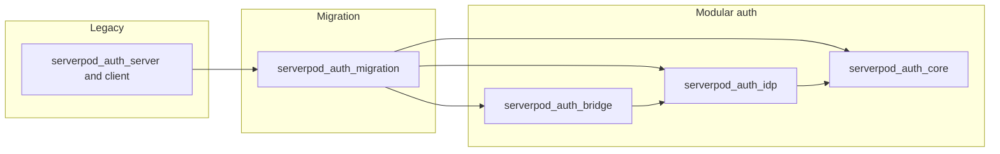

# Migrating from legacy `serverpod_auth`

:::caution Experimental migration tooling

The `serverpod_auth_migration_*` packages are **experimental**: they ship with the same version as Serverpod for testing, may receive breaking changes, and are **not yet production-ready**. Plan migrations carefully, test on a copy of production data, and read the package README on [GitHub](https://github.com/serverpod/serverpod/tree/main/modules/serverpod_auth/serverpod_auth_migration/serverpod_auth_migration_server).

:::

## When to migrate

You should plan a move off the legacy **monolith** packages under `serverpod_auth_server`, `serverpod_auth_client`, and related Flutter helpers when you want:

- Ongoing maintenance and features in the **modular Auth 2.0** stack (`serverpod_auth_core`, `serverpod_auth_idp`, `serverpod_auth_bridge`).
- UUID-based [`AuthUser`](https://github.com/serverpod/serverpod/tree/main/modules/serverpod_auth/serverpod_auth_core) identifiers instead of integer `UserInfo` IDs from legacy auth.
- New identity providers and token managers documented in [Authentication setup](/concepts/authentication/setup).

There is **no hard deadline** for apps that still run legacy auth on supported Serverpod versions, but new work should target the modular stack.

### Names used in issues vs packages on pub.dev

GitHub issue [#3663](https://github.com/serverpod/serverpod/issues/3663) refers to `serverpod_auth_email` / `serverpod_auth_email_account`. In the **current** Serverpod `main` line, email sign-in is implemented as the **Email identity provider** inside **`serverpod_auth_idp_server`** (types such as `EmailIdp`, `EmailIdpBaseEndpoint`, and generated `EmailAccount`). There is **no** separate `serverpod_auth_email_server` package in the monorepo today. This guide uses the **actual** package names.

## Target architecture



| Role | Legacy (typical) | Modular replacement |
| --- | --- | --- |
| Auth users, sessions, JWT / server-side sessions | `serverpod_auth_server` | `serverpod_auth_core_server` (+ client / Flutter) |
| Email and social identity providers | Endpoints inside legacy auth | `serverpod_auth_idp_server` (+ provider libraries) |
| Legacy passwords and session exchange | N/A | `serverpod_auth_bridge_server` (+ client / Flutter) |
| One-time data migration | N/A | `serverpod_auth_migration_server` (+ optional client) |

The migration module’s generated [`Endpoints`](https://github.com/serverpod/serverpod/blob/main/modules/serverpod_auth/serverpod_auth_migration/serverpod_auth_migration_server/lib/src/generated/endpoints.dart) wires **bridge**, **core**, **idp**, and **legacy `serverpod_auth`** module endpoints together so you can run legacy and new stacks side by side during a transition.

## Prerequisites and documentation

Before executing a migration, configure the modular stack as documented in:

- [Authentication setup](/concepts/authentication/setup)
- [Email provider setup](/concepts/authentication/providers/email/setup)
- [Database migrations](/concepts/database/migrations) (create and apply migrations after `serverpod generate`)

Your server must call `pod.initializeAuthServices(...)` **before** `await pod.start();`. That extension (from `serverpod_auth_core_server`) registers `AuthServices` and assigns `pod.authenticationHandler` to `AuthServices.instance.authenticationHandler`.

## Ordered migration checklist

1. **Add modular dependencies** (server, client, Flutter) for `serverpod_auth_core`, `serverpod_auth_idp`, and `serverpod_auth_bridge`, matching your Serverpod version. Keep legacy `serverpod_auth_*` packages until you are finished migrating data and clients.
2. **Configure** `pod.initializeAuthServices` with the same token managers and identity providers you will use in production (at minimum the email IdP if you migrate email users). Add the required secrets to `config/passwords.yaml` (for example `emailSecretHashPepper`, JWT and session peppers as in [Storing secrets](/concepts/authentication/setup#storing-secrets)).
3. **Expose** modular endpoints by subclassing the abstract provider endpoints (for example `EmailIdpBaseEndpoint`). Run `serverpod generate` and **create/apply migrations** so core, IdP, bridge, and migration tables exist.
4. **Add** `serverpod_auth_migration_server` (and client only if you expose migration RPCs yourself; batch migration is normally server-side only).
5. **Set** `AuthMigrations.config` to an `AuthMigrationConfig` whose `emailIdp` is **`AuthServices.instance.emailIdp`** (the same instance used by your app). Tune `importSessions` and `importProfile` if you need a slimmer migration.
6. **Run** `AuthMigrations.migrateUsers` once (or in batches with `maxUsers`) using a session from `pod.createSession()`, then `session.close()`. Optionally pass a `userMigration` callback to remap foreign keys from legacy `int` user IDs to new `UuidValue` auth user IDs inside the same transaction.
7. **Import legacy passwords on demand** by calling `AuthBackwardsCompatibility.importLegacyPasswordIfNeeded` from `serverpod_auth_bridge_server` before IdP email login (see below).
8. **Update Flutter** to `FlutterAuthSessionManager` and use `initAndImportLegacySessionIfNeeded` from `serverpod_auth_bridge_flutter` so existing installs can exchange a legacy session key for a new session.
9. **Stop using** legacy `serverpod_auth_client` / `serverpod_auth_shared_flutter` APIs in shipped clients; deploy forced upgrades if you rely on mobile stores.
10. **Remove** `serverpod_auth_migration_*` and legacy `serverpod_auth_*` dependencies when monitoring shows no remaining bridge rows you care about, then drop legacy columns that still reference integer user IDs.

## `serverpod_auth_migration` behavior

### `AuthMigrations.migrateUsers`

[`AuthMigrations.migrateUsers`](https://github.com/serverpod/serverpod/blob/main/modules/serverpod_auth/serverpod_auth_migration/serverpod_auth_migration_server/lib/src/business/auth_migrations.dart) selects legacy `serverpod_user_info` rows that do **not** yet appear in `serverpod_auth_migration_migrated_user`, then for each user:

- Creates an `AuthUser` in **`serverpod_auth_core`**.
- Copies email credentials from legacy `EmailAuth` into the **Email IdP** with `password: null` and stores the legacy hash via **`AuthBackwardsCompatibility.storeLegacyPassword`** (see [`migrate_user.dart`](https://github.com/serverpod/serverpod/blob/main/modules/serverpod_auth/serverpod_auth_migration/serverpod_auth_migration_server/lib/src/business/migrate_user.dart)).
- Optionally imports legacy `AuthKey` rows as bridge **legacy sessions** and legacy profile fields, controlled by `AuthMigrationConfig`.

### Idempotency

If a user already has a `MigratedUser` row, migration **skips** that user. Running `migrateUsers` multiple times is safe; the return value is the count of legacy users selected in that invocation, not necessarily “newly created” users.

### `userMigration` callback

Use [`UserMigrationFunction`](https://github.com/serverpod/serverpod/blob/main/modules/serverpod_auth/serverpod_auth_migration/serverpod_auth_migration_server/lib/src/business/user_migration_function.dart) to update your own tables when `didCreate` is true for a migrated account. Perform work **on the supplied `transaction`** so failures roll back consistently.

### Example: run after the server starts

```dart
import 'package:serverpod/serverpod.dart';
import 'package:serverpod_auth_idp_server/core.dart';
import 'package:serverpod_auth_idp_server/providers/email.dart';
import 'package:serverpod_auth_migration_server/serverpod_auth_migration_server.dart';

void run(List<String> args) async {
  final pod = Serverpod(
    args,
    Protocol(),
    Endpoints(),
  );

  // Configure token managers and identity providers (see Authentication setup).
  pod.initializeAuthServices(
    tokenManagerBuilders: [
      JwtConfigFromPasswords(),
      ServerSideSessionsConfigFromPasswords(),
    ],
    identityProviderBuilders: [
      EmailIdpConfigFromPasswords(),
    ],
  );

  await pod.start();

  AuthMigrations.config = AuthMigrationConfig(
    emailIdp: AuthServices.instance.emailIdp,
  );

  final session = await pod.createSession();
  try {
    await AuthMigrations.migrateUsers(
      session,
      userMigration: (
        session, {
        required int oldUserId,
        required UuidValue newAuthUserId,
        transaction,
      }) async {
        // Remap app-owned rows from oldUserId to newAuthUserId using transaction.
      },
    );
  } finally {
    await session.close();
  }
}
```

## Password and session continuity

- **Passwords:** Legacy hashes cannot be converted into new IdP passwords without the plaintext. After migration, accounts may have **no IdP password** until the user signs in successfully; `AuthBackwardsCompatibility.importLegacyPasswordIfNeeded` validates the presented password against the stored legacy hash and then calls `emailIdp.admin.setPassword`. The bridge module’s [`LegacyEmailEndpoint`](https://github.com/serverpod/serverpod/blob/main/modules/serverpod_auth/serverpod_auth_bridge/serverpod_auth_bridge_server/lib/src/endpoints/legacy_email_endpoint.dart) already invokes this before authenticating legacy-shaped requests.
- **New Email IdP endpoint:** If you expose `EmailIdpBaseEndpoint`, override `login` (and any other entry point that accepts a password) to call `importLegacyPasswordIfNeeded` **before** `super.login`, mirroring the bridge endpoint behavior for first-party clients.

```dart
import 'package:serverpod/serverpod.dart';
import 'package:serverpod_auth_bridge_server/serverpod_auth_bridge_server.dart';
import 'package:serverpod_auth_idp_server/providers/email.dart';

class PasswordImportingEmailIdpEndpoint extends EmailIdpBaseEndpoint {
  @override
  Future<AuthSuccess> login(
    Session session, {
    required String email,
    required String password,
  }) async {
    await AuthBackwardsCompatibility.importLegacyPasswordIfNeeded(
      session,
      email: email,
      password: password,
    );
    return super.login(session, email: email, password: password);
  }
}
```

- **Sessions:** With `importSessions: true`, legacy auth keys are stored for exchange via bridge. On Flutter, use [`SessionManagerLegacyImport.initAndImportLegacySessionIfNeeded`](https://github.com/serverpod/serverpod/blob/main/modules/serverpod_auth/serverpod_auth_bridge/serverpod_auth_bridge_flutter/lib/src/business/session_manager_legacy_import.dart) on your `FlutterAuthSessionManager`, passing `client.modules.serverpod_auth_bridge` as the caller target (requires `serverpod_auth_bridge_client` on the client).

```dart
import 'package:serverpod_auth_bridge_flutter/serverpod_auth_bridge_flutter.dart';
import 'package:serverpod_auth_core_flutter/serverpod_auth_core_flutter.dart';
import 'package:your_client/your_client.dart';

final client = Client('https://api.example.com/')
  ..authSessionManager = FlutterAuthSessionManager();

await client.authSessionManager.initAndImportLegacySessionIfNeeded(
  client.modules.serverpod_auth_bridge,
);
await client.auth.initialize();
```

## Reducing legacy traffic

There is **no** single `AuthConfig` flag documented here to disable legacy endpoints: legacy exposure is controlled by which **generated endpoint classes** you ship and which routes clients call. To prevent new legacy registrations during a cutover, stop deploying clients that call legacy methods, remove legacy endpoint subclasses from your project where possible, and gate traffic (for example maintenance pages or API gateways) until modular clients are mandatory.

## Verify success

- Query `serverpod_auth_migration_migrated_user` (or use `AuthMigrations.isUserMigrated` / `getNewAuthUserId`) for known legacy IDs.
- Attempt sign-in through the **new** IdP with an migrated account; confirm `importLegacyPasswordIfNeeded` clears legacy bridge rows once upgraded.
- Monitor bridge “legacy session” / `LegacyEmailPassword` table sizes over time.

## Troubleshooting

| Symptom | Likely cause | What to do |
| --- | --- | --- |
| `migrateUsers` throws or rolls back | Missing migrations or mismatched `emailIdp` instance | Apply all module migrations; ensure `AuthMigrations.config.emailIdp` is **`AuthServices.instance.emailIdp`** after `initializeAuthServices`. |
| Migrated user cannot log in with known password | Password not yet imported into IdP | Ensure `importLegacyPasswordIfNeeded` runs on your login path; confirm `LegacyEmailPassword` rows exist after migration. |
| Flutter app never picks up new session | Bridge client not on classpath / wrong module caller | Add `serverpod_auth_bridge_client` to the client package; pass `client.modules.serverpod_auth_bridge` into `initAndImportLegacySessionIfNeeded`. |
| `authenticationHandler` rejects modular tokens | Auth services not initialized | Call `pod.initializeAuthServices` before `start` (or assign `authenticationHandler = AuthServices.instance.authenticationHandler` yourself). |
| Duplicate or partial user mapping | Custom data outside migration callback | Perform all foreign-key updates in `userMigration` using the provided `transaction`. |

For provider-specific issues, see [Email provider configuration](/concepts/authentication/providers/email/configuration) and the [Authentication basics](/concepts/authentication/basics) page.

## Further reading

- [Upgrade to 3.0](/upgrading/upgrade-to-three) — framework breaking changes when leaving 2.x.
- [Authentication setup](/concepts/authentication/setup) — modular configuration reference.
- [Database migrations](/concepts/database/migrations) — creating and applying schema changes safely.
